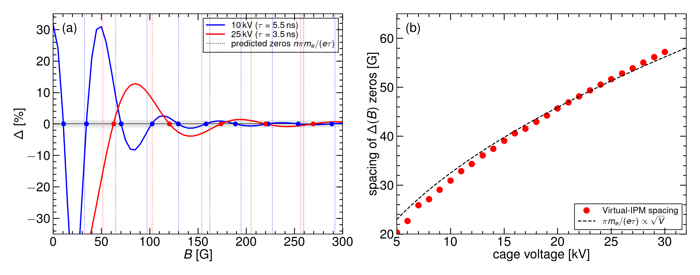
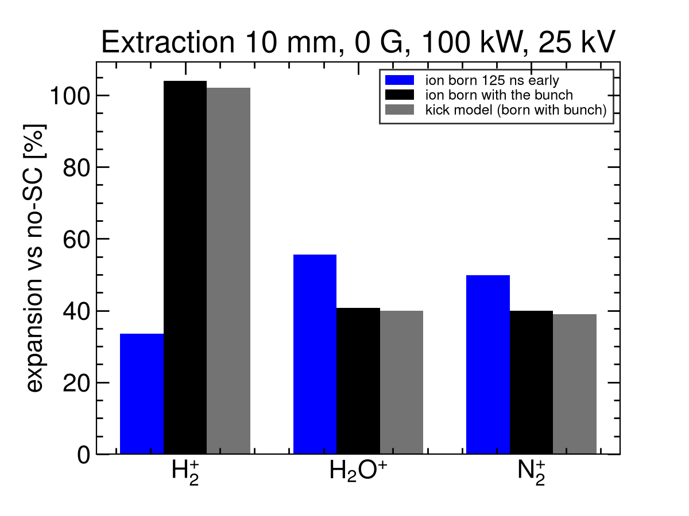

# Space-charge distortion of CSNS RCS IPM profiles

**Measured beam-size error and the efficiency of mitigation**

Prepared for internal review · 12 September 2026

Hardware: Rehman et al., Nucl. Instrum. Meth. A **1092** (2026) 171809.

Calculation: Virtual-IPM 2.3.1, uniform cage fields, 100 000 residual-gas secondaries per case. Quoted \(\sigma\) is the RMS of detected \(x\). Distortion is isolated by comparing bunch space charge on versus off, with the same guiding \(E\) and \(B\).

---

## Abstract

The CSNS RCS ionization profile monitor (IPM) records the transverse proton distribution by collecting residual-gas electrons or ions. While those secondaries drift to the collector they are kicked by the bunch space-charge field, so the detected RMS width \(\sigma_m\) is not the beam width \(\sigma_0\).

This note states how large that error is for CSNS beams, how it grows with bunch charge and shrinks with beam size, and how efficiently the available knobs — guiding \(B\), cage voltage, and a species-resolved correction — remove it.

**Electrons** can be restored. Without a magnet the collected profile is compressed or expanded by tens of percent (the sign depends on intensity and cage voltage). A guiding field of **300 G** brings every examined family, power (20–500 kW), cage voltage (10–30 kV), energy along the ramp, and few-millimetre orbit offset back to **\(\lvert\Delta\rvert\lesssim 1\%\)**. The design 0.1 T is conservative, including for \(\sigma_0=3\,\mathrm{mm}\).

**Ions cannot be restored by \(B\).** The same-sign kick always inflates the profile. At 100 kW a 10 mm beam is already +92 % (H₂⁺, injection) and **+104 %** (H₂⁺, extraction). At 500 kW the same H₂⁺ injection family reaches +422 % and a 3 mm beam fills the cage. Raising the cage from 5 to 30 kV cuts the kick but leaves a +70 % residual; a 10 % ion-mode error would need an impractical \(\sim 380\,\mathrm{kV}\). A look-up inversion of \(\sigma_m=\sigma_0\,h(\sigma_0,N,V,\mathrm{species})\) recovers \(\sigma_0\) when the ToF peak and the DCCT charge are known.

**Operating recommendation.** Collect **electrons at \(B\gtrsim 300\,\mathrm{G}\)**. Use ion time-of-flight for species identification, not for an uncorrected size.

---

## 1. The measurement and the error

The CSNS RCS IPM is a 220 × 231 mm cage with a design bias of 25 kV (\(E_y\approx 108\,\mathrm{kV/m}\)) and a magnet specified at 0.1 T (available to 0.2 T). Residual-gas ionization in the proton beam produces electrons (collected at the top electrode) and the three ion species resolved in the hardware paper — H₂⁺, H₂O⁺, N₂⁺ (collected at the bottom). The detector reports an RMS width \(\sigma_m\). The quantity of interest for operations is the true beam \(\sigma_0\).

Two bunches circulate. At 100 kW each carries \(N=7.8\times 10^{12}\) protons (scaled \(\propto P\)). Injection is 80 MeV, \(\beta=0.39\), \(\sigma_t=120\,\mathrm{ns}\), painted \(\sigma_0\simeq 25\,\mathrm{mm}\) or a 10 mm core. Extraction is 1.6 GeV, \(\beta=0.93\), \(\sigma_t=20\,\mathrm{ns}\), \(\sigma_0\simeq 10\,\mathrm{mm}\).

The bunch is a line charge. Its electric field, and the Lorentz-boosted magnetic field, act on every secondary for as long as that secondary remains near the beam. The error used throughout is \(\Delta=(\sigma_\mathrm{SC}-\sigma_\mathrm{off})/\sigma_\mathrm{off}\). A positive \(\Delta\) is an **inflated** size; a negative \(\Delta\) is **compression**. \(\Delta=0\) means the bunch field has not changed the collected width.

This study treats only that space-charge contribution. The cage fields are uniform; MCP saturation, EMI, secondary electrons from the ion trap, and the measured field map are not included. Those hardware effects, not space charge, are what the IBIC 2024–2026 CSNS papers identify as the present e-mode limit once a sufficient \(B\) is applied.

---

## 2. Why electrons and ions distort differently

Flight times set the physics. At 25 kV an electron crosses the 115.5 mm half-gap in \(\tau\simeq 3.5\,\mathrm{ns}\). The same path takes \(\tau_2\simeq 210 / 631 / 787\,\mathrm{ns}\) for H₂⁺ / H₂O⁺ / N₂⁺. The time to leave a 10 mm beam is \(\tau_0\simeq 74 / 221 / 275\,\mathrm{ns}\). Injection bunches (120 ns) are longer than \(\tau_0\) for H₂⁺; extraction bunches (20 ns) are shorter than every \(\tau_0\). Bunch spacing is 980 ns (injection) and 409 ns (extraction).

**Electrons** are attracted to the proton bunch. A moderate kick focuses them toward the axis (compression). When the bunch field exceeds the cage field they cross the axis and the collected profile is wider than the beam (over-focus). Peak transverse bunch fields at 10 mm are \(\approx 29\,\mathrm{kV/m}\) (injection) and \(\approx 73\,\mathrm{kV/m}\) (extraction) at 100 kW, versus 145 and 363 kV/m at 500 kW; the cage is 108 kV/m. At 500 kW the extraction electrons are trapped in the beam potential during the passage — voltage alone cannot sort them.

A guiding \(B\) converts the kick into a cyclotron motion. If the kick is delivered early in the flight, the displacement at the collector is \(\propto \sin(\omega_c\tau)/\omega_c\) and vanishes whenever \(\omega_c\tau=n\pi\). Successive zeros of \(\Delta(B)\) are therefore spaced by \(\Delta B=\pi m_e/(e\tau)\propto\sqrt{V}\). The **envelope** of that oscillation falls as \(B\) rises. Mitigation by \(B\) is the decay of the envelope, not a particular zero.

**Ions** have the same sign as the beam, so the kick is always outward and \(\Delta\) is always positive. In the impulsive limit (bunch \(\ll\tau_0\)) the transverse impulse scales as \(N/\sigma_0^2\) and the subsequent drift as \(\tau_2\propto 1/\sqrt{V}\), so \(h-1\equiv\Delta\propto N/(V\sigma_0^2)\) and lighter ions expand more (\(\propto M^{-1/2}\)). CSNS sits in a mixed regime: extraction is impulsive; injection is not quite, because H₂⁺ leaves the 120 ns bunch while it is still passing. Magnetic confinement is an electron tool. Even at 0.1 T the ion cyclotron phase is \(\omega_c\tau_2\simeq 1.0\) rad (H₂⁺) and 0.3 rad (heavy ions) — a \(\mathrm{sinc}\) factor of 0.84 and \(\approx 0.98\), not a restoration of the profile.

---

## 3. Distortion and size growth

### 3.1 Electrons without a magnet

At \(B=0\) the collected electron width is **not** a reliable size. On the 10 mm injection beam, 100 kW **crosses from expansion to compression at 13 kV** (12 kV +9 %, 13 kV \(\approx 0\), 14 kV −8 %). At 500 kW the same voltage scan **never changes sign**: \(\Delta\) stays positive and grows with \(V\) (+29 % at 5 kV to +83 % at 30 kV). That is the trapping regime of §2: raising \(V\) does not un-trap a 500 kW bunch.

**Figure 1.** Electron expansion versus cage voltage and \(B\) on the 10 mm injection beam. At \(B=0\) the 100 kW curve crosses zero; the 500 kW curve does not.

Obtained \(\sigma_m\) versus true \(\sigma_0\) is **not monotonic** at \(B=0\): a small beam can look larger or smaller than a large one, depending on whether the kick focuses or over-focuses. The initial Voitkiv ionization smear (\(\approx 2\)–\(2.5\,\mathrm{eV}\) per axis) adds a \(\sigma\)-independent quadrature of 2.9–3.2 mm, which is +40–48 % at \(\sigma_0=3\,\mathrm{mm}\) and only +1 % at 20 mm — and is removed as soon as \(B\) provides one gyration (§4.1).

Along the energy ramp at \(B=0\), a long bunch (120 ns) is compressed and a short bunch (20 ns) is inflated. Both errors become milder as \(\beta\) rises (the electrons spend less time in the bunch): at 100 kW the 120 ns family goes from −46 % (200 MeV) to −32 % (1.6 GeV); the 20 ns family from +77 % (80 MeV) to +38 % (1.2 GeV). **Energy does not replace a magnet.**

### 3.2 Ions: the profile is always larger than the beam

Every ion point in this study has \(\Delta>0\). Figure 2 is the size plot at the design 0.1 T and 100 kW: every species and both rings sit **above** the diagonal.

**Figure 2.** Ion-mode obtained \(\sigma_m\) versus true \(\sigma_0\) at 0.1 T, 100 kW. Dashed line: \(\sigma_m=\sigma_0\). Space charge inflates every point.

The growth with charge and the shrinkage with beam size are shown in Figure 3. Smaller beams and higher power inflate more, as \(N/\sigma_0^2\) requires.

**Figure 3.** Ion expansion versus true size at 0.1 T, 100–500 kW. The 3 mm / 500 kW family saturates on the cage wall (\(\sigma_m\approx 56\,\mathrm{mm}\)).

**Injection, 10 mm, 0.1 T, H₂⁺** — size growth with power:

| 100 kW | 200 kW | 300 kW | 400 kW | 500 kW |
|---:|---:|---:|---:|---:|
| +82 % (18.2 mm) | +175 % (27.5 mm) | +279 % (37.8 mm) | +390 % (48.9 mm) | +422 % (52.1 mm) |

Between 100 and 400 kW the growth is \(\propto P^{1.12}\), the linear kick plus the second-order term \(\sigma_m^{2}=\sigma_0^{2}+\kappa N+\cdots\). At 500 kW the profile hits the 110 mm half-cage and the exponent saturates.

**Extraction, 10 mm, 100 kW, 25 kV** (ions born in time with the bunch):

| Species | 0 G | 0.1 T | Kick model (0 G) |
|---|---:|---:|---:|
| H₂⁺ | **+104 %** (20.4 mm) | +89 % | +102 % |
| H₂O⁺ | +41 % | +40 % | +40 % |
| N₂⁺ | +40 % | +40 % | +39 % |

The 20 ns bunch is impulsive, so **H₂⁺ is the most distorted species at extraction**. At 500 kW the same 10 mm extraction family is +408 / +243 / +235 % (H₂⁺ / H₂O⁺ / N₂⁺). A reduced line-charge integration of the same equations reproduces the 0 G / 100 kW Virtual-IPM numbers to \(\pm 1\%\) absolute (Figure 4): the inflation is the space-charge kick, not a tracking artefact.

**Figure 4.** Left: 0 G, 100 kW expansions, reduced kick model versus Virtual-IPM. Right: cage-voltage scan at 0 G. Agreement is \(\pm 1\%\) absolute.

**Size law.** Between \(\sigma_0=5\) and 20 mm at 100 kW, \(\Delta\propto\sigma_0^{-1.84\ldots-2.01}\). That is the impulsive \(\sigma_0^{-2}\) of §2, not the continuous-beam \(\sigma_0^{-1.5}\). Aligned extraction H₂⁺ at 0 G / 100 kW:

| True \(\sigma_0\) [mm] | 3 | 5 | 7 | 10 | 15 | 20 |
|---:|---:|---:|---:|---:|---:|---:|
| Obtained [mm] | 38.2 | 26.8 | 22.4 | 20.4 | 21.7 | 24.9 |
| \(\Delta\) | +1172 % | +435 % | +219 % | +104 % | +44 % | +24 % |

A 3 mm extraction beam is already unusable as a size measurement at 100 kW. The worst case in the study remains **injection, 3 mm, 500 kW**: \(\sigma_m\approx 56\,\mathrm{mm}\) (+1700 %+) for all three species.

**Species ordering** follows the mixed regime. At injection, 10 mm, 0 G, 100 kW: H₂⁺ +92 %, H₂O⁺ +65 %, N₂⁺ +56 % — lighter ions expand more, but less than a pure \(M^{-1/2}\) law because H₂⁺ leaves during the 120 ns bunch. Painted injection (25 mm) is much milder: +17 / +10 / +9 %. A second extraction bunch, still in the cage when H₂O⁺ and N₂⁺ arrive, adds a few points of extra width (single-bunch +36 / +29 % versus three-bunch +41 / +40 %); H₂⁺ does not see that second bunch (+104 % either way).

Commissioning powers (aligned extraction, 10 mm, 0 G, H₂⁺): +19 % at 20 kW, +82 % at 80 kW. Even at 80 kW a 10 mm ion profile is not a 10 mm beam.

---

## 4. Mitigation and its efficiency

### 4.1 Guiding \(B\) on electrons — efficient

Figure 5 is the electron expansion versus \(B\) for the three reference beams and 100–500 kW. The curves oscillate through focusing and over-kick; the grey band is \(\pm 1\%\).

**Figure 5.** Electron-mode expansion versus \(B\), 0–300 G. Painted injection recovers first; extraction and the 10 mm injection core still oscillate through 150–250 G.

**Figure 6.** Same data, 150–300 G, \(\pm 3\%\) zoom. At **300 G** every family has settled inside \(\pm 1\%\).

The zeros of \(\Delta(B)\) are the cyclotron condition of §2. Their spacing follows \(\pi m_e/(e\tau)\propto\sqrt{V}\) to \(\le 5\%\) at every cage voltage from 10 to 30 kV, with no free parameter (Figure 7). At 25 kV the lobe amplitudes are 13, 4, 1.4, 0.9, 0.6 %; **300 G is the first field at which the envelope itself is \(\le 1\%\)** for all powers. That is why 300 G, not a particular zero, is the operating point.

**Figure 7.** Left: \(\Delta(B)\) at 10 and 25 kV with the predicted zeros \(n\pi m_e/(e\tau)\). Right: measured zero spacing versus \(\propto\sqrt{V}\).

**Efficiency of \(B\) on electrons** — smallest field after which \(\lvert\Delta\rvert\) stays below 1 %, and the residual at 300 G:

| Beam | 100 kW | 200 kW | 300 kW | 400 kW | 500 kW |
|---|---|---|---|---|---|
| Inj. 25 mm | 105 G (+0.03 %) | 115 G (+0.09 %) | 155 G (+0.16 %) | 155 G (+0.19 %) | 155 G (+0.15 %) |
| Ext. 10 mm | 240 G (−0.11 %) | 190 G (−0.24 %) | 185 G (−0.17 %) | 195 G (−0.02 %) | 205 G (+0.08 %) |
| Inj. 10 mm | 210 G (+0.61 %) | 290 G (+0.40 %) | 235 G (−0.04 %) | 190 G (−0.16 %) | 190 G (−0.15 %) |

Painted injection is fixed first. The last curve to settle is the 10 mm injection core at 200 kW (290 G). **300 G keeps every power \(\lesssim 1\%\).**

The same 300 G point holds when the other axes are opened:

- **Size.** From 200 G the obtained-versus-true plot lies on the diagonal except at 3 mm. At 300 G, injection 3 mm is still +1 % (100 kW) to +4 % (500 kW). **0.1 T puts 3, 10 and 20 mm on the diagonal at every power** (\(\lvert\Delta\rvert\le 0.05\%\)).
- **Cage voltage.** At 300 G, 10–25 kV, both 100 and 500 kW stay \(\lesssim 1\%\). Higher \(V\) needs slightly more \(B\) at 100 kW (150 G at 10 kV → 210 G at 25 kV) because \(\tau\) is shorter and the first lobes move out; 500 kW recovers earlier at every \(V\).
- **Energy.** At 300 G / 100 kW, \(\lvert\Delta\rvert\le 0.5\%\) from 80 MeV to 1.6 GeV for both 120 ns and 20 ns bunches. The low-\(\beta\) injection error of §3.1 is a \(B=0\) phenomenon.
- **Commissioning power.** At 300 G and 20 / 50 / 80 kW: painted injection +0.00 / +0.01 / +0.02 %; extraction 10 mm +0.28 / +0.56 / +0.18 %; injection 10 mm +0.11 / +0.29 / +0.49 %.
- **Orbit.** A few millimetres of \(\Delta y\) (toward or away from the collector) changes \(\Delta\) by a few percent at \(B=0\) and by \(\lesssim 1\%\) at 300 G. The 1 % threshold moves by at most \(\sim 10\,\mathrm{G}\). \(\Delta x\) is a translation of a uniform cage and does not change the width. Centroid shift versus no-SC falls as \(1/B\) (E×B / polarisation drift): 0.9 mm at 100 G → 0.2 mm at 300 G on the extraction beam.

**Figure 8.** Electron obtained \(\sigma_m\) versus true \(\sigma_0\). From 200 G the points lie on the diagonal; 0.1 T includes the 3 mm beams.

**Net efficiency.** Guiding \(B=300\,\mathrm{G}\) reduces an electron-mode error of tens of percent (and the wrong sign at 100 kW / high \(V\)) to \(\lesssim 1\%\). The design 0.1 T has a factor-of-three margin and is the right field for a 3 mm beam. The CSNS magnet (0.2 T) is not the limiting device. SNS designed 300 G for \(25\times\) this bunch charge and estimated \(\approx 7\%\) residual; \(\lesssim 1\%\) at CSNS is the expected scaling.

### 4.2 Guiding \(B\) on ions — inefficient

**Figure 9.** Ion expansion versus \(B\) for the three reference beams. Rows are species. The curves are flat from 0 to 200 G; 0.1 T is a small downward step for H₂⁺ only.

Between 0 and 200 G every ion expansion changes by \(<0.5\%\). At 0.1 T, injection H₂⁺ (10 mm, 100 kW) falls from +92 % to +82 % — the \(\mathrm{sinc}(1.01)\approx 0.84\) factor of §2 — while H₂O⁺ and N₂⁺ move by \(<1\%\). Aligned extraction H₂⁺ falls from +104 % to +89 %. The 0.2 T magnet would give \(\omega_c\tau_2\approx 2\,\mathrm{rad}\) for H₂⁺ and still not return \(\Delta\) to the percent level.

**Net efficiency.** The e-mode \(B\) knob is **not** an ion-mode size knob. Do not raise \(B\) expecting an ion profile to recover.

### 4.3 Cage voltage — opposite roles, incomplete for ions

For **electrons at \(B=0\)**, voltage is not a size correction: it can flip the sign of \(\Delta\) at 100 kW and cannot flip it at 500 kW (§3.1). With \(B\ge 300\,\mathrm{G}\) the design 25 kV is already inside 1 %, so voltage is free for collection efficiency and MCP operation.

For **ions**, higher \(V\) shortens \(\tau_2\) and reduces the integrated kick, as at ISIS (broadening \(\propto 1/E\)). H₂⁺ injection, 10 mm, 100 kW, 0.1 T:

| 5 kV | 10 kV | 15 kV | 20 kV | 25 kV | 30 kV |
|---:|---:|---:|---:|---:|---:|
| +198 % | +168 % | +126 % | +100 % | +82 % | +70 % |

Aligned extraction H₂⁺, 10 mm, 100 kW, 0 G: +280 % (5 kV) → +104 % (25 kV) → +93 % (30 kV). The 0 G scan scales as \(V^{-0.92}\) (H₂⁺) and \(V^{-0.77}\) (H₂O⁺). Extrapolating the \(V^{-0.9}\) law, a **10 %** bias on the 10 mm injection beam at 100 kW would need \(\approx 380\,\mathrm{kV}\) across the cage. That is not a hardware path.

**Figure 10.** Ion expansion versus \(B\) at each cage voltage (injection 10 mm). Expansion stays positive at every \(V\).

**Net efficiency.** Voltage is a useful **lever** on ion bias (a factor \(\sim 3\) from 5 to 30 kV) and is **not a cure**. ESS can run ions at 300 kV/m because its bunches are \(5000\times\) weaker; CSNS cannot copy that choice.

### 4.4 Orbit offset — mitigation is robust

\(\Delta x=+5\) or \(+10\,\mathrm{mm}\) leaves both electron and ion widths unchanged at 100 kW (the kick is centred on the beam). \(\Delta y=\pm 5\,\mathrm{mm}\) changes the drift length and therefore \(\tau\): ion \(\Delta\) moves by a few percent, in quantitative agreement with \(\sigma_m^{2}-\sigma_0^{2}\propto d\) (0.5 % absolute). Electron recovery at 300 G is preserved (\(\lvert\Delta\rvert\le 0.65\%\) out to \(\pm 10\,\mathrm{mm}\)).

At 500 kW an uncorrected ion profile (\(\sigma_m\approx 52\,\mathrm{mm}\)) is clipped by the cage; a 10 mm horizontal offset then pulls the centroid by 4 mm. That is an aperture effect, not a failure of the 300 G e-mode point.

**Net efficiency.** A few-millimetre closed-orbit offset does not undo electron recovery and is a small, predictable correction on ions.

### 4.5 Software inversion of ion widths — efficient if \(N\) and species are known

Because the ion bias is large, smooth, and reproduced by a one-dimensional kick model, \(\sigma_0\) can be recovered from \(\sigma_m\) without changing the hardware.

1. Identify the ToF peak (H₂⁺, H₂O⁺ or N₂⁺).
2. Read \(\sigma_m\) and the DCCT bunch charge \(N\).
3. Invert \(\sigma_m=\sigma_0\cdot(1+\Delta)\) using a table \(\Delta(\sigma_0,N,V,\mathrm{species})\) — the kick model or the Virtual-IPM points — by a few substitutions starting from \(\sigma_0=\sigma_m\).

This is the Fermilab Booster / Shiltsev recipe (15 % early in the cycle to a factor of two at 8 GeV; 5–10 % accuracy on \(\sigma_0\)). CSNS has the same inputs plus resolved ToF peaks. Use the **aligned** extraction column (H₂⁺ +104 % at 10 mm / 100 kW / 0 G), not an ion born off the bunch. Do not apply the 300 G e-mode factor to ions.

**Limits.** The inversion assumes the profile has not hit the cage. At 3 mm / 500 kW it has; no table recovers \(\sigma_0\) from a wall-saturated RMS. Field-cage non-uniformity (J-PARC reported a factor-of-two shrink from the external map alone) is not in the present table and will have to be folded in once the CSNS CST/measured map exists.

**Figure 11.** Extraction 10 mm, 0 G, 100 kW, 25 kV. Virtual-IPM with the ion born in time with the bunch matches the kick model. These are the extraction ion widths to invert.

### 4.6 Summary of efficiencies

| Mitigation | Electron mode | Ion mode |
|---|---|---|
| \(B=300\,\mathrm{G}\) | Tens of % → ≲ 1 % (all \(P\), \(V\), energy; \(\sigma\ge 4\,\mathrm{mm}\)) | No recovery (flat to 200 G) |
| Design \(B=0.1\,\mathrm{T}\) | 3 mm on the diagonal; residual ≤ 0.05 % | H₂⁺ down ~10 % relatively; heavy ions unchanged |
| Raise \(V\) (5 → 30 kV) | Not a size fix at \(B=0\); unused once \(B\ge 300\,\mathrm{G}\) | +198 % → +70 % (H₂⁺ inj. 10 mm, 100 kW). 10 % needs ~380 kV |
| Orbit ≲ 10 mm | 300 G still ≲ 1 % | Δx: none. Δy: a few % |
| Invert \(\sigma_m=\sigma_0\,h(\sigma_0,N,V)\) | Unnecessary at ≥ 300 G | Recovers \(\sigma_0\) if \(N\) and species known and the profile is inside the cage |

---

## 5. Recommended operating point

1. **Collect electrons with \(B\gtrsim 300\,\mathrm{G}\).** This is the only mitigation that returns a faithful size. The design 0.1 T is a conservative setting, including at 500 kW and \(\sigma_0=3\,\mathrm{mm}\), and sits well below the 0.2 T magnet.
2. **Keep the design 25 kV** for electron collection once \(B\) is in place. Do not try to tune size with voltage at \(B=0\).
3. **Commissioning (20–80 kW) at 300 G** already has \(\lvert\Delta\rvert\le 0.5\%\). Space charge will not be the e-mode error at those currents.
4. **Do not report an uncorrected ion RMS as a beam size.** At 100 kW a 10 mm beam is +17 % (painted H₂⁺) to +104 % (extraction H₂⁺). Invert with the species-resolved table, or use the ion ToF only to label the residual gas.
5. **After space charge is removed, the remaining e-mode systematic is hardware:** MCP saturation after \(\sim 200\,\mu\mathrm{s}\), EMI, secondary electrons, and the real cage map. Those are outside this calculation.

---

## 6. Conclusions

Space charge distorts CSNS RCS IPM profiles by a mechanism that is now quantitative.

Electrons see an attractive kick that can focus or over-focus. The resulting \(\Delta(B)\) is a cyclotron-phase oscillation whose envelope falls below 1 % at **300 G** for every beam, power, voltage and offset examined, and along the energy ramp. Size growth with charge, and the non-monotonic \(\sigma_m(\sigma_0)\) at \(B=0\), both disappear at that field. The design 0.1 T is a margin, not a requirement, except for the smallest (3 mm) beams.

Ions see a repulsive kick and **always** come out larger than the beam. The inflation scales as \(N/\sigma_0^2\) (impulsive) and as \(\approx 1/V\), matches a reduced kick model to 1 %, and is essentially independent of \(B\). Raising the cage voltage or the magnet cannot bring a 10 mm, 100 kW ion profile to the 10 % level. A look-up inversion can, provided the profile has not hit the wall.

The practical conclusion is therefore unchanged by the size, power, voltage, offset and ramp checks: **operate the IPM in electron mode at \(B\gtrsim 300\,\mathrm{G}\); treat ion-mode widths as space-charge biased unless they are inverted.**

Comparison with the IPM literature (2006–2026), including the Vilsmeier–Sapinski–Storey \(B_\mathrm{min}\) fit and the Shiltsev / ISIS ion corrections, is in `LITERATURE_REVIEW.md`.

## Appendix

Rebuild this PDF: `python3 scripts/md_to_pdf.py --md CSNS_IPM_REPORT.md --pdf CSNS_IPM_REPORT.pdf --footer "CSNS RCS IPM — space-charge distortion"`.

Campaign matrices, particle CSVs and evaluators remain in `IMODE_REPORT.md`, `SCAN_MATRIX_V2.md` and `output/`. This note does not document those scans.
