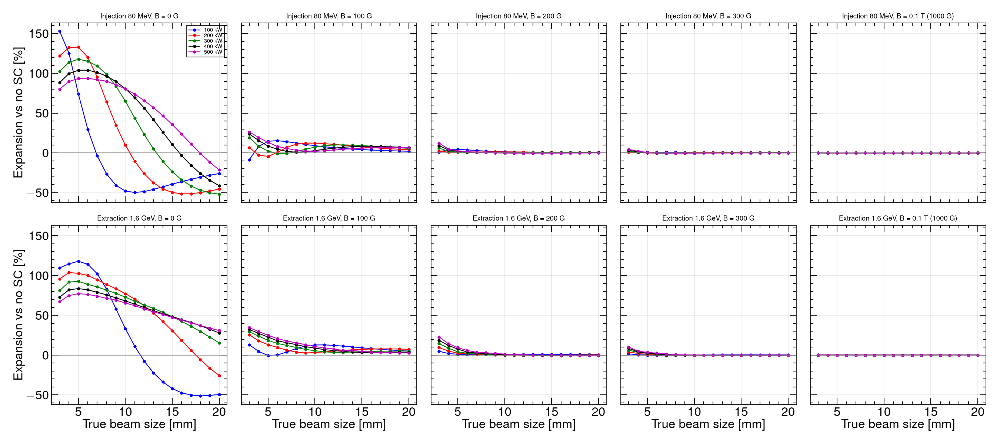

# CSNS RCS IPM — Electron-mode and ion-mode results

**Code:** Virtual-IPM 2.3.1. **Reference:** Rehman et al., NIM A **1092** (2026) 171809.  
**Cage:** 220 × 231 mm, design \(V = 25\,\mathrm{kV}\) so \(E_y = V/d \approx 108\,\mathrm{kV/m}\); design \(B_y = 0.1\,\mathrm{T}\).  
**Statistics:** 100000 secondaries per run; quoted \(\sigma\) is the RMS of **detected** \(x\). Space charge is the Gaussian bunch \(E\) plus Lorentz-boosted bunch \(B\), compared with those fields off. Guiding \(E\) and \(B\) stay uniform.

This report covers the **round-beam** e-mode replan (Blocks A–D + fine C/D), the parallel **ion-mode** matrix (Blocks A–D), and **scan matrix v2** (1014 new 100k-particle runs: aligned extraction ions, ramp / β, phase-aware voltage, commissioning power, single-bunch train). Elliptical 25×20 / 10×8 mm archives remain in [`REPORT.md`](REPORT.md) §§1–6 as a closed reference; they are not reused here. V2 plan and timing contract: [`SCAN_MATRIX_V2.md`](SCAN_MATRIX_V2.md).

---

## 1. Setup

| | Injection | Extraction |
|---|---|---|
| Proton energy | 80 MeV | 1.6 GeV |
| Bunch length \(\sigma_t\) | 120 ns | 20 ns |
| Round-beam \(\sigma_x=\sigma_y\) | 25 mm (painted) or 10 mm | 10 mm |
| Bunch population at 100 kW | \(7.8\times10^{12}\) | same, \(\propto P\) |

- **Electron mode:** Voitkiv DDCS, GasType Hydrogen only (Virtual-IPM has no N₂/H₂O electron DDCS). Collection at the top electrode. Tracker: Boris, 8000 steps. RNG 1234.
- **Ion mode:** ZeroMomentum ions at rest masses 2 / 18 / 28 u (H₂⁺, H₂O⁺, N₂⁺ — the paper ToF peaks). Collection at the bottom electrode. Bunch fields off in the generator plus a circular 3-bunch train.
- **SC-off** is run once per geometry at 100 kW and shared across power (no bunch field ⇒ independent of bunch population).

Re-run: `./scripts/run_emode_replan.sh`, `./scripts/run_emode_fine_cd.sh`, `./scripts/run_imode_replan.sh`, `JOBS=4 ./scripts/run_v2.sh`.  
Evaluate: `python3 scripts/evaluate_emode.py --from-summary`, `python3 scripts/evaluate_imode.py --from-summary`, `python3 scripts/evaluate_v2.py`.

---

## 2. Takeaways

1. **Electron IPM is recoverable with guiding \(B\).** Expansion oscillates with \(B\) (focusing / over-kick of opposite-sign electrons). **300 G** keeps every scanned round-beam family, power (100–500 kW), cage voltage (5–30 kV), and \(\Delta y\) offset (\(\pm10\,\mathrm{mm}\)) within \(\lesssim 1\%\). Painted injection recovers first (~105–155 G); extraction and 10 mm injection need ~190–290 G.
2. **Ion IPM is not recovered by \(B\).** Expansion is flat from 0 to 200 G and only slightly lower at 0.1 T. Cyclotron radii at these fields are metres. **Do not use the e-mode \(B\) knob on ions.**
3. **Ion distortion scales with power and inversely with beam size.** H₂⁺ injection, 10 mm, 0.1 T: +82% at 100 kW → +422% at 500 kW. At \(\sigma=3\,\mathrm{mm}\) / 500 kW the obtained width saturates on the cage (~56 mm, +1700%+) for all three species.
4. **Cage voltage has opposite roles.** In e-mode at \(B=0\), 100 kW **crosses zero at 13 kV** (expansion → compression); 500 kW never flips. In ion-mode expansion stays **positive** at every \(V\); higher \(V\) shortens ToF and **reduces** the kick (H₂⁺ inj. 10 mm @ 0.1 T: +198% at 5 kV → +70% at 30 kV).
5. **Offset:** \(\Delta x\) is translation-invariant in both modes. \(\Delta y\) (toward/away from the detector) changes expansion by a few percent and does not undo the 300 G e-mode recovery.
6. **Extraction ion timing is now aligned (v2 I1).** The v1 extraction train arrived 125 ns late. Re-running with tracking `LongitudinalOffset` = −80 ns gives H₂⁺ **+104 %** at 10 mm / 100 kW / 0 G (v1 as-run +33.5 % was a lower bound), H₂O⁺ +41 %, N₂⁺ +40 % — matching the kick model (+102 / +40 / +39 %). Use the aligned table for extraction ion widths.
7. **Practical implication:** tune \(B\) and \(V\) for a faithful **electron** profile; treat **ion-mode sizes as space-charge biased** unless a correction is applied. At commissioning power (20–80 kW) e-mode at 300 G stays ≤ 0.5 %.

---

## 3. Electron mode

**Status: complete.** Replan A–D 2502 / 2502; fine C/D 3270 / 3270 new (5772 particle CSVs including A–D). All blocks use **round beams** \(\sigma_y=\sigma_x\).

| Block | What is scanned | Beams | \(\sigma\) | \(B\) | Power |
|---|---|---|---|---|---|
| **A** | Guiding field | inj. 25 mm; ext. 10 mm; inj. 10 mm | round | **0–300 G / 5 G** | 100–500 kW |
| **B** | Beam size | inj.; ext. | 3–20 mm / 1 mm | 0, 100, 200, 300 G, 0.1 T | 100–500 kW |
| **C** | Cage voltage | inj. 10 mm | round | 0–300 G / 25 G + 0.1 T | 100, 500 kW |
| Fine C | Voltage × \(B\) | inj. 10 mm | round | diagnostic \(B\) + 5 G at 10–25 kV | 100, 500 kW |
| **D** | Beam offset | inj.; ext. 10 mm | round | 0, 100, 200, 300 G, 0.1 T | 100, 500 kW |
| Fine D | \(\Delta y\) | inj.; ext. 10 mm | round | diagnostic \(B\) + 5 G at \(\pm5\,\mathrm{mm}\) | 100, 500 kW |

Diagnostic \(B\): 0, 25, 50, 75, 100, 125, 150, 200, 250, 300, 1000 G. Fine C voltages: 5–30 kV / 1 kV. Fine D: \(\Delta y=-10\ldots+10\,\mathrm{mm}\) / 1 mm, \(\Delta x=0\).

### 3.1 Block A — \(B\) scan 0–300 G

**Figure 1.** Profile expansion vs no-SC for the three round reference beams, 100–500 kW. The grey band is \(\pm1\%\).

**Figure 2.** Same scan, 150–300 G, \(\pm3\%\) zoom. Extraction and 10 mm injection still oscillate through ~150–250 G; **300 G** has settled.

Smallest \(B\) after which \(|\Delta|\) stays below 1% for the rest of the grid, and \(\Delta\) at 300 G:

| Family | 100 kW | 200 kW | 300 kW | 400 kW | 500 kW |
|---|---|---|---|---|---|
| Inj. 25×25 mm | 105 G (+0.03%) | 115 G (+0.09%) | 155 G (+0.16%) | 155 G (+0.19%) | 155 G (+0.15%) |
| Ext. 10×10 mm | 240 G (−0.11%) | 190 G (−0.24%) | 185 G (−0.17%) | 195 G (−0.02%) | 205 G (+0.08%) |
| Inj. 10×10 mm | 210 G (+0.61%) | 290 G (+0.40%) | 235 G (−0.04%) | 190 G (−0.16%) | 190 G (−0.15%) |

Painted injection recovers first. The last curve to settle is 10×10 mm injection at 200 kW (threshold 290 G). **300 G keeps every power \(\lesssim 1\%\).**

### 3.2 Block B — size 3–20 mm

**Figure 3.** Obtained \(\sigma\) vs true \(\sigma\) at 0, 100, 200, 300 G and 0.1 T. Dashed line: obtained = true.

**Figure 4.** Expansion vs true beam size at the same \(B\) points.

At \(B=0\) obtained \(\sigma\) is **not** a monotonic function of true \(\sigma\) (focusing vs over-kick). From **200 G** the points lie on the diagonal except the tiniest beams. At **300 G**, injection 3 mm is still +1% (100 kW) to +4% (500 kW). **0.1 T** puts 3, 10, and 20 mm on the diagonal at every power.

### 3.3 Block C — cage voltage, including the 1 kV / 5 G fine scan

**Figure 5.** Coarse C: 5–30 kV / 5 kV on injection 10×10 mm.

**Figure 6.** Fine C: 1 kV heatmap at diagnostic \(B\), and 5 G \(B\)-scans at 10, 12, 15, 18, 20, 25 kV.

At \(B=0\), **100 kW crosses zero at 13 kV** (12 kV +9.4%, 13 kV ~0%, 14 kV −8.3%). **500 kW never flips**: \(\Delta\) stays positive and grows with \(V\) (+29% at 5 kV to +83% at 30 kV).

The 5 G scans show the same cyclotron/ToF oscillation as Block A, with the first peak later in \(B\) as \(V\) rises. 1% threshold on 0–300 G:

| \(V\) [kV] | 100 kW | 500 kW | \(\Delta\) at 300 G (100 / 500 kW) |
|---:|---:|---:|---|
| 10 | 150 G | 130 G | +0.15% / +0.02% |
| 12 | 195 G | 135 G | −0.31% / −0.05% |
| 15 | 195 G | 145 G | +0.47% / +0.03% |
| 18 | 210 G | 160 G | −0.47% / +0.01% |
| 20 | 220 G | 170 G | −0.57% / −0.19% |
| 25 (Block A) | 210 G | 190 G | +0.61% / −0.15% |

**300 G** still puts every scanned voltage \(\lesssim 1\%\). Higher cage voltage needs more \(B\) at 100 kW; 500 kW recovers earlier at every \(V\).

### 3.4 Block D — beam offset, including the 1 mm \(\Delta y\) fine scan

**Figure 7.** Coarse D: four offsets on 10×10 mm injection and extraction.

**Figure 8.** Fine D: expansion vs \(\Delta y\) at diagnostic \(B\), and 5 G \(B\)-scans at \(\Delta y=\pm5\,\mathrm{mm}\) vs centred.

Expansion vs \(\Delta y\) is **smooth and nearly linear** from −10 to +10 mm. Toward the detector (\(\Delta y<0\)) vs away (\(\Delta y>0\)) changes \(\Delta\) by a few percent at \(B=0\) and by \(\lesssim 1\%\) once \(B=300\,\mathrm{G}\). The \(\pm5\,\mathrm{mm}\) 5 G scans overlay the centred Block A curves; the 1% threshold moves by at most ~10 G.

| Family | \(\Delta y=-5\) mm | centred | \(\Delta y=+5\) mm |
|---|---|---|---|
| Inj. 100 kW | 210 G | 210 G | 205 G |
| Inj. 500 kW | 190 G | 190 G | 185 G |
| Ext. 100 kW | 245 G | 240 G | 235 G |
| Ext. 500 kW | 205 G | 205 G | 205 G |

At **300 G** and **0.1 T**, expansion stays \(\lesssim 1\%\) for every offset. Centroid shift vs no-SC is \(\lesssim 0.2\,\mathrm{mm}\) (injection) and \(\lesssim 0.6\,\mathrm{mm}\) (extraction, 500 kW, 300 G). A few-mm orbit offset does not undo the \(B\) recovery. No \(\Delta x\) scan: the cage is translation-invariant in \(x\).

---

## 4. Ion mode

**Status: complete.** v1: 2070 / 2070 runs (Blocks A–D). v2 I1–I3: aligned extraction, look-up powers, and single-bunch train (see §4.5). Round beams; H₂⁺ / H₂O⁺ / N₂⁺. **No dense \(B\)-scan** — only \(\{0, 200, 1000\}\,\mathrm{G}\) in v1 — because closed ion scans were already flat vs \(B\).

| Block | What is scanned | Beams | \(\sigma\) | \(B\) [G] | Power [kW] |
|---|---|---|---|---:|---|
| **A** | Reference beams | inj. 25 mm; ext. 10 mm; inj. 10 mm | round | 0, 200, 1000 | 100–500 |
| **B** | Beam size | inj.; ext. | 3–20 mm / 1 mm | 0, 200, 1000 | 100–500 |
| **C** | Cage voltage | inj. 10 mm | round | 0, 200, 1000 | 100, 500 |
| **D** | Beam offset | inj.; ext. 10 mm | round | 0, 200, 1000 | 100, 500 |

SC-off reference: H₂⁺ @ 100 kW only (mass-independent without bunch fields, shared).

### 4.1 Block A — reference beams vs \(B\)

**Figure 9.** Expansion vs \(B\) for the three reference beams. Each row is a species; columns are painted injection (25×25 mm), extraction (10×10 mm), and small injection (10×10 mm).

Expansion is **essentially independent of \(B\)** between 0 and 200 G. The 0.1 T point is sometimes slightly lower but never restores the profile.

Expansion at 100 kW [%]:

| Species | Inj. 25 mm 0 G | 200 G | 1000 G | Inj. 10 mm 0 G | 200 G | 1000 G | Ext. 10 mm 0 G | 200 G | 1000 G |
|---|---:|---:|---:|---:|---:|---:|---:|---:|---:|
| H₂⁺ | +16.7 | +16.7 | +15.0 | +92.0 | +91.6 | +82.1 | +33.5† | +33.4† | +31.6† |
| H₂O⁺ | +10.4 | +10.4 | +10.2 | +64.7 | +64.7 | +63.8 | +55.6† | +55.6† | +54.9† |
| N₂⁺ | +8.9 | +8.9 | +8.9 | +56.3 | +56.2 | +55.7 | +49.9† | +49.9† | +49.5† |

† v1 as-run extraction (125 ns generation lag). **Superseded by v2 I1** (table below). Painted injection matches the elliptical-beam design-field numbers (~+16% H₂⁺). The 10 mm injection family is the most distorted at every \(B\). Injection is correctly aligned in v1 (both centres at 480 ns).

Aligned extraction, 10 mm, 100 kW, 25 kV (v2 I1; tracking offset −80 ns):

| Species | 0 G aligned | 0.1 T aligned | v1 as-run 0 G | Kick model aligned |
|---|---:|---:|---:|---:|
| H₂⁺ | **+104.1 %** | +89.1 % | +33.5 % | +102 % |
| H₂O⁺ | **+40.8 %** | +40.1 % | +55.6 % | +40 % |
| N₂⁺ | **+40.0 %** | +39.6 % | +49.9 % | +39 % |

H₂⁺ at extraction is the most distorted species once timing is correct (impulsive 20 ns bunch, light ion). H₂O⁺ / N₂⁺ drop from the as-run whole-bunch values to the half-bunch kick-model values. At 500 kW, 0 G, aligned 10 mm: H₂⁺ +408 %, H₂O⁺ +243 %, N₂⁺ +235 %. Details: [`LITERATURE_REVIEW.md`](LITERATURE_REVIEW.md) §§3.5–3.7 and [`SCAN_MATRIX_V2.md`](SCAN_MATRIX_V2.md) §7.

### 4.2 Block B — size 3–20 mm

**Figure 10.** Obtained \(\sigma\) vs true \(\sigma\) at 0.1 T, 100 kW. Dashed line: obtained = true. Every point lies **above** the diagonal.

**Figure 11.** Expansion vs true \(\sigma\) at 0.1 T for 100–500 kW. Smaller beams and higher power inflate more.

Obtained size at \(\sigma_x = 10\,\mathrm{mm}\), 0.1 T, 100 kW:

| Species | Inj. obtained | Inj. expansion | Ext. obtained† | Ext. expansion† |
|---|---:|---:|---:|---:|
| H₂⁺ | 18.2 mm | +82% | 13.2 mm | +32% |
| H₂O⁺ | 16.4 mm | +64% | 15.5 mm | +55% |
| N₂⁺ | 15.5 mm | +56% | 15.0 mm | +50% |

† v1 as-run extraction (125 ns lag). Aligned 0.1 T / 100 kW / 10 mm: H₂⁺ 19.0 mm (+89 %), H₂O⁺ 14.0 mm (+40 %), N₂⁺ 14.0 mm (+40 %).

H₂⁺ injection, \(\sigma=10\,\mathrm{mm}\), 0.1 T vs power:

| 100 kW | 200 kW | 300 kW | 400 kW | 500 kW |
|---:|---:|---:|---:|---:|
| +82% (18.2 mm) | +175% (27.5 mm) | +279% (37.8 mm) | +390% (48.9 mm) | +422% (52.1 mm) |

Lighter ions expand more at injection (\(\Delta v = q\int E_\mathrm{sc}\,dt/m\)). Once extraction timing is aligned, the short 20 ns bunch is impulsive and **H₂⁺ is the most distorted species at extraction** (+104 % at 0 G, +89 % at 0.1 T); the v1 as-run table above under-states that kick. Worst case remains **injection, \(\sigma=3\,\mathrm{mm}\), 500 kW, 0.1 T** — obtained \(\sigma \approx 56\,\mathrm{mm}\) (+1700%+) for all three species (cage-wall saturation). Aligned extraction at 3 mm / 100 kW / 0 G already gives H₂⁺ +1172 % (38 mm).

### 4.3 Block C — cage voltage 5–30 kV

**Figure 12.** Expansion vs \(B\) for each cage voltage, injection 10×10 mm. Unlike e-mode, ion expansion **never changes sign**.

H₂⁺ injection 10 mm, 100 kW, 0.1 T vs cage voltage:

| 5 kV | 10 kV | 15 kV | 20 kV | 25 kV | 30 kV |
|---:|---:|---:|---:|---:|---:|
| +198% | +168% | +126% | +100% | +82% | +70% |

Higher \(V\) shortens ion drift and reduces the integrated kick. At 500 kW the same trend holds at much larger expansion (+300% to +800% range).

### 4.4 Block D — beam offset

**Figure 13.** Expansion vs \(B\) for each offset (100 kW). \(\Delta x=+5\) and \(+10\,\mathrm{mm}\) overlay the centred beam. \(\Delta y=\pm5\,\mathrm{mm}\) changes expansion by a few percent.

H₂⁺ injection 10 mm, 0.1 T, 100 kW vs offset:

| centred | \(\Delta x=+5\) | \(\Delta x=+10\) | \(\Delta y=+5\) | \(\Delta y=-5\) |
|---|---:|---:|---:|---:|
| +82.1% | +82.1% | +82.1% | +84.0% | +80.0% |

Toward the detector (\(\Delta y<0\)): slightly less expansion. Centroid shift vs no-SC is \(\lesssim 0.6\,\mathrm{mm}\) at extraction, 500 kW.

### 4.5 Scan matrix v2 — aligned extraction, ramp, commissioning

**Status: complete.** 1014 / 1014 new 100k-particle CSVs (finished 2026-09-12 05:48 UTC). 735 evaluated SC-on pairs in `output/csns_v2_summary.csv`. Plan and timing contract: [`SCAN_MATRIX_V2.md`](SCAN_MATRIX_V2.md). Extraction ions use tracking `LongitudinalOffset` = −80 ns so the generation window and the first field-carrying bunch are both centred at 80 ns.

| Block | What is scanned | Result used below |
|---|---|---|
| **I1** | Aligned extraction: sizes 3–20 mm, \(V\) 5–30 kV, offsets, 0 / 0.1 T, 100–500 kW | Replaces every v1 extraction ion width |
| **I2** | Look-up \(h(\sigma_0,N)\): 5 sizes × 10 powers, aligned extraction (injection low-\(P\) unpaired) | Correction table at commissioning powers |
| **I3** | Single bunch vs 3-bunch at 100 kW | Multi-bunch term for heavy ions only |
| **E1** | Ramp 80–1600 MeV at fixed \(\sigma=10\,\mathrm{mm}\), \(\sigma_t\in\{120,20\}\,\mathrm{ns}\) | Low-\(\beta\) check at 300 G |
| **E3** | Phase-aware \(B\) grids × 10/15/20/30 kV on ext. 10 mm and inj. 25 mm | 300 G still \(\lesssim 1\%\) |
| **E4** | 20 / 50 / 80 kW on the three reference beams | Commissioning at 300 G |

**Figure 14.** Extraction 10 mm, 0 G, 100 kW, 25 kV. v2 aligned Virtual-IPM matches the kick-model aligned column (H₂⁺ +104 % vs +102 %; H₂O⁺ +41 % vs +40 %; N₂⁺ +40 % vs +39 %) and replaces the v1 as-run lower bound (H₂⁺ +33.5 %).

Aligned extraction H₂⁺ vs true size, 100 kW, 0 G, 25 kV:

| \(\sigma_0\) [mm] | 3 | 5 | 7 | 10 | 15 | 20 |
|---:|---:|---:|---:|---:|---:|---:|
| Obtained [mm] | 38.2 | 26.8 | 22.4 | 20.4 | 21.7 | 24.9 |
| Expansion | +1172 % | +435 % | +219 % | +104 % | +44.5 % | +24.4 % |

Aligned extraction H₂⁺ vs cage voltage, 10 mm, 100 kW, 0 G:

| 5 kV | 10 kV | 15 kV | 20 kV | 25 kV | 30 kV |
|---:|---:|---:|---:|---:|---:|
| +280 % | +179 % | +141 % | +119 % | +104 % | +93 % |

Same trend as injection Block C (higher \(V\) shortens ToF) but starting from the aligned, not the as-run, 25 kV point. Offsets at 10 mm / 100 kW / 0 G: \(\Delta x=+10\,\mathrm{mm}\) identical to centred (+104.1 %); \(\Delta y=+5\,\mathrm{mm}\) +106.7 %; \(\Delta y=-5\,\mathrm{mm}\) +101.4 %.

**I3** (100 kW, 0 G). Injection single-bunch equals the v1 3-bunch reference (H₂⁺ +16.7 % at 25 mm, +92.0 % at 10 mm). Extraction H₂⁺ single-bunch equals the I1 3-bunch point (+104.1 %): the 20 ns bunch is gone before the next RF bucket. Extraction H₂O⁺ / N₂⁺ drop from +40.8 / +40.0 % (3-bunch) to +35.7 / +28.5 % (single): the heavy ions still sit in the cage when the second bunch arrives.

**I2** aligned extraction, 0 G, look-up powers (H₂⁺, 10 mm): +19 % (20 kW), +82 % (80 kW), +160 % (150 kW), +277 % (250 kW). At 25 mm / 80 kW the same species is only +12 %. Use these columns — not v1 as-run extraction — for the §3.7 correction recipe.

**E1** at 300 G / 100 kW stays inside \(\pm0.5\%\) at every scanned energy for both \(\sigma_t\). At 0 G the long-bunch (120 ns) family is compressed and the short-bunch (20 ns) family is inflated; both shrink toward the 1.6 GeV values as \(\beta\) rises. 80 MeV / 120 ns is the reused v1 Block A injection 10 mm point (+0.61 % at 300 G).

| Energy | 0 G, 120 ns | 300 G, 120 ns | 0 G, 20 ns | 300 G, 20 ns |
|---|---:|---:|---:|---:|
| 80 MeV | (v1) | (v1 +0.61 %) | +77.3 % | −0.20 % |
| 200 MeV | −45.6 % | +0.42 % | +77.6 % | −0.28 % |
| 400 MeV | −39.6 % | +0.32 % | +66.7 % | −0.25 % |
| 800 MeV | −34.8 % | +0.27 % | +47.4 % | −0.17 % |
| 1.2 GeV | −33.0 % | +0.25 % | +38.2 % | −0.13 % |
| 1.6 GeV | −32.0 % | +0.24 % | (v1) | (v1 −0.11 %) |

**E3.** Phase-aware grids at 10–30 kV on extraction 10 mm and painted injection 25 mm. Near 300 G, 30 kV / 100 kW: ext. 10 mm +0.05 % (280 G) / +0.97 % (310 G); inj. 25 mm \(\lesssim 0.1\%\). The 300 G recommendation still holds on the beams and voltages that v1 Block C did not cover.

**E4** at 300 G (commissioning):

| Beam | 20 kW | 50 kW | 80 kW |
|---|---:|---:|---:|
| Inj. 25 mm | +0.00 % | +0.01 % | +0.02 % |
| Ext. 10 mm | +0.28 % | +0.56 % | +0.18 % |
| Inj. 10 mm | +0.11 % | +0.29 % | +0.49 % |

---

## 5. Electron vs ion

| | Electron mode | Ion mode |
|---|---|---|
| Secondaries | e− (Voitkiv H₂) | H₂⁺ / H₂O⁺ / N₂⁺ |
| \(B\) grid | dense (5 G / 25 G) | 0, 200, 1000 G only |
| Effect of \(B\) | oscillatory recovery; **300 G fixes** the profile | **flat**; no recovery |
| Cage voltage | sign flip at 13 kV (100 kW, \(B=0\)); 500 kW never flips | always positive; higher \(V\) **reduces** kick |
| Beam offset | \(\Delta x\) invariant; \(\Delta y\) few % | same |
| Worst case | low \(B\), wrong \(V\) polarity | small \(\sigma\), high \(P\); aligned extraction H₂⁺ or injection |
| Design 0.1 T | conservative for electrons (also on the E1 ramp and at 20–80 kW) | still +15 % (painted inj.) to +89 % (aligned ext. H₂⁺, 10 mm, 100 kW) |
| Extraction ions | n/a | **use v2 aligned widths** (H₂⁺ +104 % at 0 G / 10 mm / 100 kW); v1 +33.5 % is a timing artefact |

**Operate the CSNS RCS IPM in electron mode with \(B\gtrsim 300\,\mathrm{G}\).** That point stays \(\lesssim 1\%\) on the v1 families, the E1 ramp, E3 voltages, and E4 commissioning powers. Ion-mode profiles remain space-charge inflated at every scanned \(B\), \(V\), size, power, and offset; invert them with the aligned \(h(\sigma_0,N)\) table, or restrict ion ToF to species identification rather than size.

---

## 6. Data products

| File | Contents |
|---|---|
| `output/csns_emode_bscan300_summary.csv` | E-mode Block A |
| `output/csns_emode_size_summary.csv` | E-mode Block B |
| `output/csns_emode_voltage_summary.csv` | E-mode Block C (coarse) |
| `output/csns_emode_offset_summary.csv` | E-mode Block D (coarse) |
| `output/csns_emode_voltage_fine_summary.csv` | Fine C |
| `output/csns_emode_offset_fine_summary.csv` | Fine D |
| `output/csns_imode_bscan_summary.csv` | Ion-mode Block A (135 rows) |
| `output/csns_imode_size_summary.csv` | Ion-mode Block B (1620 rows) |
| `output/csns_imode_voltage_summary.csv` | Ion-mode Block C (108 rows) |
| `output/csns_imode_offset_summary.csv` | Ion-mode Block D (180 rows) |
| `output/csns_imode_kick_model.csv` | Reduced line-charge model vs Virtual-IPM (0 G); aligned extraction column |
| `output/csns_review_scaling_checks.csv` | Literature scaling checks: Fine C zero spacing vs π m_e/(e ToF), Block B initial-velocity smear, ion size exponents, ion Δy vs drift length |
| `output/csns_v2_summary.csv` | Scan matrix v2: 735 SC-on pairs (E1, E3, E4, I1–I3) |
| `output/csns_scan_matrix_v2.csv` | Planned v2 point list |
| `plots/csns_emode_*.png` | Figures 1–8 |
| `plots/csns_imode_*.png` | Figures 9–13 |
| `plots/csns_v2_aligned_extraction.png` | Figure 14 — aligned vs as-run vs kick model |

Particle CSVs under `output/emode/`, `output/imode/`, and `output/v2/` are gitignored. Lab notebook with the closed elliptical campaigns: [`REPORT.md`](REPORT.md). Ion-only write-up: [`IMODE_REPORT.md`](IMODE_REPORT.md). Comparison with IPM papers 2006–2026: [`LITERATURE_REVIEW.md`](LITERATURE_REVIEW.md) / [`LITERATURE_REVIEW.pdf`](LITERATURE_REVIEW.pdf). V2 plan: [`SCAN_MATRIX_V2.md`](SCAN_MATRIX_V2.md).

Rebuild this PDF: `python3 scripts/md_to_pdf.py --md CSNS_IPM_REPORT.md --pdf CSNS_IPM_REPORT.pdf --footer "CSNS RCS IPM — e-mode and ion-mode"`.
