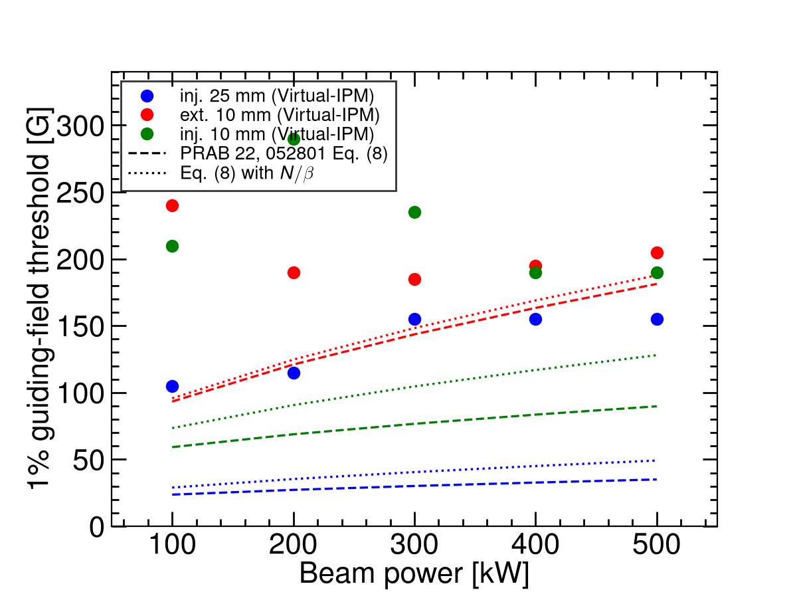
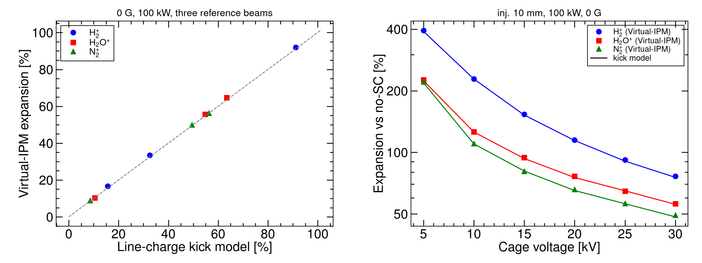

# CSNS RCS IPM simulations — review against IPM publications (2006–2026)

**Scope.** This note checks the Virtual-IPM 2.3.1 results collected in [`CSNS_IPM_REPORT.md`](CSNS_IPM_REPORT.md) (electron mode, Blocks A–D + fine C/D; ion mode, Blocks A–D) against IPM design rules, measurements and simulation studies published in the last twenty years (2006–2026). Each comparison section states what the literature predicts for the CSNS parameters, what the simulations gave, and whether the two agree. A machine-by-machine survey of that period is in Section 4. Reproduce the comparison figures with `python3 scripts/literature_compare.py` (summary CSVs only, no Virtual-IPM runs).

**CSNS parameters used throughout.** Cage 220 × 231 mm, 25 kV so E ≈ 108 kV/m, design B = 0.1 T; 7.8 × 10¹² p/bunch at 100 kW (∝ power), two bunches per turn; injection 80 MeV (β = 0.39, σₜ = 120 ns, revolution 1.96 µs), extraction 1.6 GeV (β = 0.93, σₜ = 20 ns, revolution 0.82 µs). Round beams σ = 25 mm (painted injection) or 10 mm.

---

## 1. Summary of the review

1. **Electron mode agrees with the field-scaling literature in trend and order of magnitude.** The 1 % thresholds found here (105–155 G painted injection, 185–240 G extraction, 190–290 G 10 mm injection) are 1.1–4× above the Vilsmeier–Sapinski–Storey minimum-field fit (PRAB 22, 052801), which was fitted for β ≥ 0.99 and a monotonic distortion. The recommended 300 G matches the SNS ring IPM design point (300 G, ≈7 % estimated error for 2 × 10¹⁴ p) and sits well below the CSNS design (0.1 T) and the 0.2 T available magnet — the same field used by the CERN PS BGI (< 2.5 % distortion for LHC-type bunches).
2. **Ion mode agrees quantitatively with space-charge kick theory.** A reduced line-charge model of the type used by Shiltsev (NIM A 986 (2021) 164744) reproduces every 0 G / 100 kW Virtual-IPM expansion to within ±1 % absolute (Figure 2), the V⁻⁰·⁹ cage-voltage law matches the ISIS "broadening ∝ 1/drift field" result, and the flatness versus B follows from the cyclotron phase ω τ ≲ 1 rad accumulated during the ion flight. The ion-mode bias (+9 % to +92 % at 100 kW, up to +422 % at 500 kW) is of the size reported operationally at J-PARC RCS (IPM 20–30 % wider than the MWPM) and at the Fermilab Booster (correction ≈ 15 % to ≈ 2×).
3. **Two caveats surfaced by the review.**
   - The **extraction ion-mode configuration** generates ions 125 ns before the first field-carrying bunch (generation bunch centred at 4σₜ = 80 ns, tracking train centred at 204.6 ns). H₂⁺ therefore drifts ≈ 40 mm before the kick and the extraction H₂⁺ expansion (+33 %) is under-estimated; the reduced model gives ≈ +100 % for a time-aligned generation. H₂O⁺ and N₂⁺ barely move in 125 ns and instead see the whole bunch instead of half of it (≈ +40 % expected vs +50–56 % obtained). Injection is correctly aligned (both centred at 480 ns). Section 3.5 gives the fix for a future run; no existing run was repeated.
   - The simulations use **uniform** guiding fields and stop at the collector: no MCP, no ion trap, no field-cage non-uniformity, no secondary electrons. J-PARC reported that its RCS IPM profile was shrunk to half by external-field distortion alone, and the CSNS IBIC 2024–2026 papers describe MCP saturation after 200 µs and secondary-electron suppression as the dominant hardware issues. These effects, not space charge, currently limit the CSNS e-mode measurement.
4. **Recommendation unchanged, now literature-backed:** run the CSNS RCS IPM in electron mode with B ≳ 300 G (the design 0.1 T is conservative up to 500 kW and σ = 3 mm), and treat ion-mode sizes as space-charge biased. A species-resolved correction of the Shiltsev / ISIS type is feasible for CSNS because the ToF peaks (H₂⁺, H₂O⁺, N₂⁺) are resolved and the bunch charge is known turn by turn.

---

## 2. Electron mode

### 2.1 Minimum guiding field: Vilsmeier, Sapinski, Storey, PRAB 22, 052801 (2019)

The paper derives, from Virtual-IPM scans over 0.2–20 mm, 0.3–300 ns and 10⁹–10¹³ charges (relativistic beams, β ≥ 0.99), the minimum field for a ≤ 1 % increase of the measured RMS width,

B_min,1% [T] = d · N^a / (σ_z^b · σ_t^c) + f / σ_t^e, with (a, b, c, d, e, f) = (0.613, 0.590, 1.082, 0.105, 0.967, 0.038) for Gaussian bunches; N in 10¹², σ_z in ns, σ_t in mm.

The first term is the space-charge term, the second the initial-velocity (gyroradius) term. The fit reproduces the SIS100 design (76 mT predicted vs 84 mT foreseen).

**Figure 1.** Block A 1 % thresholds (points: smallest B after which |Δ| ≤ 1 % for the rest of the 0–300 G grid) compared with Eq. (8) (dashed) and Eq. (8) with N replaced by N/β to account for the longer field exposure of a slow beam (dotted).

| Family | Power | Virtual-IPM | Eq. (8) | Eq. (8), N/β |
|---|---:|---:|---:|---:|
| Inj. 25 mm | 100 kW | 105 G | 24 G | 29 G |
| Inj. 25 mm | 500 kW | 155 G | 35 G | 49 G |
| Inj. 10 mm | 100 kW | 210 G | 59 G | 73 G |
| Inj. 10 mm | 500 kW | 190 G | 90 G | 128 G |
| Ext. 10 mm | 100 kW | 240 G | 93 G | 96 G |
| Ext. 10 mm | 500 kW | 205 G | 181 G | 188 G |

**Assessment.** The ordering of the families and the absolute scale (tens to a few hundred gauss, far below the LHC-type 0.2–0.5 T regime) agree. The simulated thresholds exceed the fit by 1.1× (extraction, 500 kW) to 4× (painted injection). Three reasons are identifiable:

- **Threshold definition.** Our curves oscillate in sign with B (focusing vs over-kick of the electron, Figures 1–2 and 6 of the report). "Last B at which |Δ| leaves the ±1 % band" is stricter than the monotonic σ_m/σ_t − 1 = τ used for the fit; a single excursion at, e.g., 285 G sets the 10 mm / 200 kW threshold to 290 G although 200–280 G are already inside the band.
- **Low β.** At 80 MeV the electrons stay in the bunch field 2.5× longer than for β ≈ 1 and the longitudinal bunch field is no longer negligible; the paper restricts its fit to β ≥ 0.99 for precisely this reason. The N/β column recovers part of the gap at injection but not all of it.
- **Weak power dependence.** The fit scales as N^0.61 (×2.7 between 100 and 500 kW) whereas the simulated thresholds are flat or even decrease with power (10 mm injection 210 → 190 G). This is the same oscillatory mechanism: a stronger kick moves the first over-focusing peak to a different B rather than just raising the distortion, so a monotone power law cannot be expected.

The initial-velocity term of the fit (0.038/σ_t^0.967 T) alone gives 15 G (25 mm) to 38 G (10 mm) and 0.13 T at 3 mm; this is why in Block B the 3 mm beams stay +1–4 % at 300 G and only 0.1 T brings them onto the diagonal. The 0.1 T CSNS design value is therefore the right order for the smallest beams, and 300 G is ample for σ ≥ 10 mm.

### 2.2 Distortion mechanisms

The report's B = 0 phenomenology (expansion at low V, compression above 13 kV at 100 kW, never-flipping expansion at 500 kW) maps onto the regimes described in the PRAB paper and in the early SNS design notes:

- **Trapping when the bunch field exceeds the extraction field.** Peak transverse bunch fields for the CSNS cases (2D Gaussian line charge): 12 kV/m (inj. 25 mm), 29 kV/m (inj. 10 mm), 73 kV/m (ext. 10 mm) at 100 kW; 145 and 363 kV/m for the 10 mm beams at 500 kW. The cage field is 108 kV/m. At 500 kW the extraction bunch field exceeds the cage field around 1–2 σ, i.e. the electrons are trapped in the beam potential during the bunch passage — the situation the PRAB paper identifies as needing B rather than V. This is the origin of the "500 kW never flips" observation in Block C.
- **Polarisation drift and gyroradius increase.** With B on, the paper describes the distortion as a gyroradius increase plus an E × B / polarisation drift; roughly 90 % of the electrons end up with larger gyroradii. In our 5 G scans this shows as the damped oscillation of Δ with B whose period lengthens as V rises (later first peak in Fine C), consistent with the electron time-of-flight setting the number of gyrations performed inside the bunch field.

### 2.3 Machine comparisons

| Machine / paper | Beam and field | Reported distortion | CSNS this work |
|---|---|---|---|
| SNS ring IPM, Bartkoski & Deibele, NIM A 767 (2014) 379 | 2 × 10¹⁴ p, 120 kV bias, 300 G | ≈ 7 % estimated; an earlier ORNL note argued 250 G suffices, 0.1 T in the original design | 7.8 × 10¹² p (25× less charge) at 300 G: ≲ 1 % for all families, powers and offsets |
| J-PARC RCS IPM, Satou et al., HB2010 WEO1C05 | 4.5 × 10¹² p, ion mode operational; 3-pole wiggler for e-mode | ion mode 20–30 % wider than MWPM; e-mode without B dominated by contamination; profile shrunk 2× by external-field non-uniformity | same ion-mode magnitude (Section 3); uniform fields assumed, so the field-error effect is not modelled |
| CERN PS BGI, NIM A 1081 (2026) 170845 | LHC-type bunches, 200 mT, hybrid-pixel detection | < 2.5 % distortion in simulation | LHC-type bunches sit at the 0.2–0.5 T end of the PRAB scaling; CSNS bunches (long, wide) need 10× less |
| GSI SIS100 IPM (PRAB 22 example) | 2 × 10¹³, σ = 2.17 mm, σ_z = 15 ns, 84 mT | fit gives 76 mT | our 3 mm / 20 ns extraction case needs ≈ 0.1 T — same regime |
| CSNS RCS IPM, Rehman et al., NIM A 1092 (2026) 171809; IBIC'24 WEP18; IBIC'25 TUPMO41; IBIC'26 MOP026 | 220 × 231 mm cage, up to 30 kV after conditioning, magnet up to 0.2 T, MCP readout; ion and electron modes | MCP saturation after 200 µs at 80 kW; EMI; secondary electrons from ions hitting the cage in e-mode → slit ion trap | simulation covers space charge only; the recommended 300 G is 6× below the available 0.2 T |

**Assessment.** No published magnetic IPM operating at a comparable charge per bunch reports a distortion inconsistent with ours: the SNS design (300 G, 25× the charge) expected ≈ 7 %, so ≲ 1 % at CSNS is the expected scaling. The hardware issues reported for the CSNS IPM (saturation, EMI, secondary electrons) are outside the simulated physics and will dominate the e-mode systematic error once the guiding field is ≥ 300 G.

---

## 3. Ion mode

### 3.1 Kick-model theory: Shiltsev, NIM A 986 (2021) 164744; PRAB 24, 044001 (2021)

Shiltsev gives a closed-form description of the space-charge expansion in ion IPMs without a magnetic field. Two regimes matter here:

- **Long or frequent bunches** (bunch length or spacing ≲ ion transit times): σ_m = σ₀ · h with h ≈ 1 + 2.41 · (U_sc · D / (V₀ σ₀)) · √(d/σ₀) for a Gaussian beam, U_sc = J / (4πε₀ v_p) the beam space-charge potential. h is independent of the ion species. For the CSNS average current (1.3 A at injection, 3.1 A at extraction) U_sc ≈ 100 V and h − 1 ≈ 75 % (σ₀ = 10 mm) and 19 % (25 mm).
- **Short, rare bunches** (bunch ≪ τ₀ ≪ spacing): the ion receives an impulse Δvₓ = 2Ze²N_p/(4πε₀ β M c) · x₀/r₀² · (1 − exp(−r₀²/2σ₀²)) and drifts for the transit time τ₂ = √(2dM/(ZeE)). The expansion then adds in quadrature, depends on Z/M (displacement ∝ M^−1/2), and heavier ions are preferred.

CSNS characteristic times at 25 kV: τ₀ (time to leave the beam) = 74 / 221 / 275 ns and τ₂ (transit to the collector) = 210 / 631 / 787 ns for H₂⁺ / H₂O⁺ / N₂⁺. With σₜ = 120 ns and 980 ns spacing at injection and 20 ns / 409 ns at extraction, CSNS sits between the two regimes: bunches are rare (τ₂ < spacing for H₂⁺), the extraction bunch is impulsive, the injection bunch is not (σₜ > τ₀ for H₂⁺). The simulated species ordering reflects this: at injection H₂⁺ > H₂O⁺ > N₂⁺ (+92 / +65 / +56 %), compressed relative to the M^−1/2 law of the impulsive limit because the light ion leaves the beam during the 120 ns bunch.

### 3.2 Direct check with a reduced model

To test the Virtual-IPM numbers against this physics, `scripts/literature_compare.py` integrates the same equations numerically (ions at rest, uniform E_y, 2D Gaussian line-charge field of the bunch train with the Virtual-IPM bunch timing, no MCP, ions counted at the collector; 30 000 ions per case, ≈ 1 s each).

**Figure 2.** Left: 0 G, 100 kW expansions for the three species and three reference beams, reduced model vs Virtual-IPM. Right: Block C cage-voltage scan at 0 G (points) with the reduced model (lines).

| Case (0 G, 100 kW) | H₂⁺ model / Virtual-IPM | H₂O⁺ | N₂⁺ |
|---|---:|---:|---:|
| Inj. 25 mm | +15.6 / +16.7 % | +10.1 / +10.4 % | +8.8 / +8.9 % |
| Inj. 10 mm | +91.2 / +92.0 % | +64.4 / +64.7 % | +55.1 / +56.3 % |
| Ext. 10 mm | +32.6 / +33.5 % | +55.4 / +55.6 % | +50.2 / +49.9 % |
| Inj. 10 mm, 5 → 30 kV | 391 / 395 % → 75 / 77 % | 226 / 227 % → 56 / 56 % | 220 / 221 % → 51 / 49 % |

**Assessment.** Agreement is within ±1 % absolute for every point, including the counter-intuitive extraction ordering (heavy ions more distorted than H₂⁺). The Virtual-IPM ion-mode numbers are therefore exactly what the space-charge kick physics of the configured beams predicts; there is no numerical artefact. The agreement also means the reduced model can serve as a fast correction curve generator (Section 3.6).

### 3.3 Cage voltage and beam power

- **ISIS** (Pine, Payne, Warsop et al., EPAC06 / DIPAC07 and later reviews): "transverse trajectory deflection, and thus beam broadening, should be proportional to the reciprocal of the drift field", confirmed experimentally and in CST + tracking simulations. A linear scaling correction removes most of the error for reasonably centred beams (within ≈ 10 mm of the axis). Our 0 G Block C gives expansion ∝ V⁻⁰·⁹² (H₂⁺) and V⁻⁰·⁷⁷ (H₂O⁺) over 5–30 kV — the 1/E law with the expected saturation for heavier, slower ions that see part of a second bunch at low V.
- **Shiltsev** h − 1 ∝ N/V₀: our 0.1 T power scan (H₂⁺, 10 mm) grows as P¹·¹² between 100 and 400 kW (+82 → +390 %) and then saturates on the cage (+422 % at 500 kW, obtained σ ≈ 52 mm of a 110 mm half-aperture). The slightly super-linear exponent is the second-order term of the kick expansion (σₘ² = σ₀² + κN + κ²N²/σ₀² · …).
- **J-PARC RCS prototype** (Satou et al., EPAC06 TUPCH065): ion-mode broadening ≈ 8 % at 10 kV on the KEK-PS test, estimated ≈ 50 % at the 150 kV/m J-PARC RCS design field for σ = 30 mm and a 250 ns bunch. **ESS** (Marroncle, Benedetti, Belloni et al., IBIC'23 WEP001; JINST 15 (2020) T05007) chose ion collection at 300 kV/m for 1.5 × 10⁹ p bunches: electrons fail the ±10 % width requirement at that field, while ions stay below 5 % for 90 MeV beams larger than 2 mm. Extrapolating our V⁻⁰·⁹ law, a 10 % bias for the 10 mm CSNS injection beam at 100 kW would need ≈ 380 kV across the cage — not a practical route; this is the quantitative reason the report recommends against using ion-mode widths without correction.

### 3.4 Why B does not help ions

Between 0 and 200 G every ion expansion changes by < 0.5 %, and 0.1 T lowers H₂⁺ by ≈ 10 % relative (92 → 82 %) but H₂O⁺/N₂⁺ by < 1 %. This is the cyclotron phase accumulated during the transit: ω_c τ₂ = 0.20 rad (H₂⁺, 200 G), 1.01 rad (H₂⁺, 0.1 T), 0.34 rad (H₂O⁺, 0.1 T), 0.27 rad (N₂⁺, 0.1 T). A transverse kick applied early in the flight is reduced by ≈ sin(ω τ)/(ω τ) = 0.84 for H₂⁺ at 0.1 T and 0.98–0.99 for the heavy ions, reproducing the simulated 92 → 82 %, 65 → 64 % and 56 → 56 %. Shiltsev's remark that ion IPMs are operated without magnets, and Vilsmeier's that magnetic confinement is an electron-mode tool, are both confirmed for CSNS: even the full 0.2 T magnet (ω τ ≈ 2 rad for H₂⁺) would not restore ion profiles.

### 3.5 Timing caveat in the extraction ion configuration

In `generate_csns_configs.py` the ions are generated by a single fields-off bunch (Virtual-IPM default longitudinal offset −4σₜ, so the generation window is centred at t = 4σₜ) and tracked in a three-bunch circular train whose `LongitudinalOffset` is −spacing/2. At injection both centres fall at 480 ns, so ions see on average half of their own bunch — the assumption Shiltsev makes and the reduced model reproduces. At extraction the generation window is centred at 80 ns but the first tracking bunch arrives at 204.6 ns:

- H₂⁺ has already moved ≈ 40 mm towards the collector when the bunch passes, so it receives a much weaker, mostly vertical kick. The reduced model with a time-aligned generation gives **≈ +100 %** for H₂⁺ at extraction (0 G, 100 kW) instead of the +33 % obtained.
- H₂O⁺ and N₂⁺ move only 3–4 mm in 125 ns and instead see the **whole** bunch rather than half of it; aligned generation gives ≈ +40 % for both instead of +56 / +50 %.

The qualitative conclusions (positive bias at every V, B, size and offset; no recovery by B) are unaffected, but the extraction ion table in the report should be read with this in mind, and the extraction H₂⁺ numbers are a lower bound. A future extraction ion run should set the tracking train's `LongitudinalOffset` to −80 ns (= −4σₜ) or give the generation bunch an explicit offset of −204.6 ns. In line with the campaign rules no existing 100k run was repeated for this review.

Aligned vs as-run expansions at 0 G, 100 kW, 25 kV (reduced model; Virtual-IPM is the as-run column):

| Species | Inj. 25 mm model / VIPM | Inj. 10 mm | Ext. 10 mm as-run | Ext. 10 mm aligned |
|---|---:|---:|---:|---:|
| H₂⁺ | +15.6 / +16.7 % | +91.2 / +92.0 % | +32.6 / +33.5 % | +102 % |
| H₂O⁺ | +10.1 / +10.4 % | +64.4 / +64.7 % | +55.4 / +55.6 % | +40 % |
| N₂⁺ | +8.8 / +8.9 % | +55.1 / +56.3 % | +50.2 / +49.9 % | +39 % |

The as-run / aligned pair is written to `output/csns_imode_kick_model.csv` by `scripts/literature_compare.py`.

### 3.6 Correction strategies in the literature

- **Analytic inversion (Fermilab Booster).** Shiltsev inverts σ_m = σ₀ h(σ₀, N, V₀, D, d) turn by turn using the DCCT intensity; the correction is ≈ 15 % early in the cycle and ≈ 2× at 8 GeV, and reaches 5–10 % accuracy on σ₀. CSNS has the same inputs (bunch charge, cage voltage, geometry) plus species-resolved ToF peaks, so a per-species inversion is possible. Because CSNS is in the mixed regime (Section 3.1), the inversion should use a numerically generated h(σ₀, N, V, species) table — the reduced model or Virtual-IPM itself — rather than the closed form.

  **Practical recipe for CSNS ion-mode widths.** Identify the ToF peak (H₂⁺ / H₂O⁺ / N₂⁺). Read the measured RMS σ_m and the DCCT bunch charge N. Look up or interpolate h(σ₀, N, V, species) from `output/csns_imode_kick_model.csv` (or re-run `scripts/literature_compare.py`) and solve σ_m = σ₀ · (1 + h) by a few substitutions, starting from σ₀ = σ_m. Use the **aligned** extraction column, not the as-run Virtual-IPM extraction H₂⁺ number. Do not apply the e-mode 300 G knob to ions.
- **Tracking-based correction (ISIS).** CST field maps plus in-house tracking give correction factors for the measured percentage widths; a linear scaling is enough for reasonably centred beams. The same approach with the real (non-uniform) CSNS cage field is the natural next step once the field map is available.
- **Machine learning (PRAB 22, 052801; IBIC'17 WEPCC06; IPAC'18 WEPAK008; HB'18 THA2WE02).** Regressors trained on simulated distorted profiles reconstruct either the RMS width or the full shape. For CSNS this is optional: at ≥ 300 G the e-mode profile is already within 1 %, and the ion-mode bias is large but smooth in σ₀, N and V, so a look-up inversion suffices.

---

## 4. Twenty-year survey (2006–2026)

The last two decades of IPM work fall into three overlapping threads: **magnetic electron collection** as the high-intensity default, **analytic or ML correction** of residual ion-mode (and weak-B electron-mode) distortion, and **detector / vacuum engineering** (MCP ageing, EMI, ion traps, hybrid pixels). The CSNS RCS IPM sits in all three. RHIC (1999–2001, 0.12 T, strip anodes) is the immediate ancestor of the magnetic electron-mode design used at Tevatron, SNS, LHC/SPS and CSNS.

| Year | Facility and result | Relation to this work |
|---|---|---|
| 2006 | J-PARC RCS prototype (EPAC06 TUPCH065). Ion +8 % at 10 kV on KEK-PS; ≈ 50 % predicted at 150 kV/m (σ = 30 mm, 250 ns). 3-pole wiggler for e-mode. | Same ion physics; our 10 mm / 100 kW expansions are +56 to +92 % at higher charge density. |
| 2006–11 | Fermilab Tevatron Mk3: e-mode, 0.1–0.2 T, 10 kV / 63 mm. ISIS RCS/EPB: ion mode, no B, up to 60 kV; broadening ∝ 1/E (EPAC06, DIPAC07). | Tevatron B is the CSNS magnet class. ISIS 1/E law is Block C. |
| 2009 | CSNS RCS design (PAC'09 TH5RFP022): e-mode, 0.1 T, ~24 kV. | Design point of this campaign. |
| 2010 | J-PARC RCS/MR (HB2010 WEO1C05). Ion IPM 20–30 % wider than MWPM; e-mode without B contaminated; RCS profile shrunk 2× by field error. | Ion bias matches Block A. Field error is the largest un-modelled e-mode systematic. |
| 2011 | GSI SIS18 / ESR / COSY (DIPAC11 TUPD51). ~80 mT for e-mode; ions broaden, electrons shrink without B; MCP+P47 optical readout. | Same B = 0 sign rule as our voltage scan. |
| 2012 | LHC BGI (IBIC'12 TUPB61). e-mode (Ne), 0.2 T. Matches wire scanner at injection; larger than WS at 4 TeV; MCP ageing. | LHC bunches sit at the high-B end of the PRAB scaling; CSNS bunches are 10× longer and wider. |
| 2014 | SNS ring (NIM A 767 379). e-mode, 300 G, 120 kV; ≈ 7 % estimated error at 2 × 10¹⁴ p. | 300 G is our recommended point; CSNS has 25× less charge so ≲ 1 % is the expected scaling. |
| 2016 | J-PARC MR (IBIC'16 WEPG69). 0.2 T C+H magnet required for 30 GeV fast-extraction bunches. | CSNS magnet can reach the same 0.2 T. |
| 2016–18 | IPM simulation workshops (CERN, GSI, J-PARC); Virtual-IPM, IBIC'17 WEPCC07. | This is the code used here. |
| 2017 | CERN PS Timepix3 BGI (JINST 12 C02050), 0.2 T. ARIES workshop: SPS/LHC BGI needs ≳ 1 T for nominal LHC beam in the SPS. | Detector is outside our simulation. Confirms CSNS (long, wide bunches) is a 0.03 T problem, not a 1 T problem. |
| 2019 | Vilsmeier, Sapinski, Storey, PRAB 22 052801. B_min,1% scaling (Eq. 8); ML reconstruction. | Section 2.1; our thresholds are 1.1–4× the fit. |
| 2020 | ESS cold linac NPM (JINST 15 T05007; IBIC'23 WEP001). Ion mode at 300 kV/m; electrons fail the ±10 % width spec; ions < 5 % at 90 MeV, σ > 2 mm, 1.5 × 10⁹ p. | Opposite conclusion to CSNS because ESS bunches are 5000× emptier — ion mode only works at low N. |
| 2020–21 | Shiltsev, NIM A 986 164744; PRAB 24 044001; IBIC'21 TUPP05. Closed-form ion expansion h; 5–10 % inversion of Booster σ₀. | Section 3; reduced model agrees with Virtual-IPM to ±1 %. |
| 2024–26 | CSNS RCS IPM commissioning (IBIC'24 WEP18, IBIC'25 TUPMO41, NIM A 1092 171809, IBIC'26 MOP026). EMI, MCP saturation after 200 µs at 80 kW; ToF peaks H₂ / H₂O / N₂; slit ion trap. | Hardware, not space charge, currently limits the e-mode measurement. |
| 2026 | CERN PS BGI (NIM A 1081 170845). e-mode, 200 mT, Timepix; < 2.5 % size distortion in simulation. | Same B as the CSNS magnet; LHC-type bunches. |

**What changed over twenty years, and what did not.** Every high-intensity hadron machine that published an IPM paper in this period ended in the same place: collect electrons and apply B ≳ a few hundred gauss to a tesla, or collect ions and correct. The quantitative B needed is set by bunch charge, length and width (PRAB 22), not by a universal "0.2 T" rule — LHC/SPS sit at the tesla end, CSNS/SNS/J-PARC RCS at a few hundred gauss, SIS100 at ~80 mT. Ion-mode corrections matured from ISIS's empirical 1/E law (2006) to Shiltsev's closed form (2020) to ML on simulated profiles (2017–2019). Detector work moved from MCP+strips (RHIC, Tevatron, J-PARC) through MCP+phosphor+camera (LHC, GSI) to hybrid pixels (PS BGI) and, at CSNS, a gated cage plus an ion trap — none of which is in the present tracking.

---

## 5. Modelling assumptions versus the literature

| Assumption here | Literature practice | Impact |
|---|---|---|
| Uniform E and B in the cage | Vilsmeier: uniform; J-PARC: 3D field map needed (profile shrunk 2×); ISIS: CST maps | Field non-uniformity is the largest un-modelled e-mode systematic |
| Electron generation from the Voitkiv H₂ DDCS only | PRAB 22, 052801 and Virtual-IPM benchmarks use the same H₂ DDCS | Standard; N₂/H₂O electron spectra are not available in Virtual-IPM |
| Ions at rest (ZeroMomentum) | Shiltsev: dissociative ionization gives H⁺ a few eV → σ_T ≈ 1 mm smearing; ESS/J-PARC likewise ignore or add in quadrature | Adds ≲ 1 mm in quadrature; negligible against +9–90 % biases |
| Detected-particle RMS at the collector, no MCP, no detector window | PS BGI and CSNS papers model the detector explicitly (Geant4 / MCP gain) | Widths at 500 kW / 3 mm saturate on the 110 mm half-cage, not on the 30 × 80 mm MCP window of the real device |
| Single bunch (e-mode) / 3-bunch circular train (ion mode) | Shiltsev's (1 + 0.8 t_b/τ₀) correction for bunched beams; ISIS multi-turn ions | Correct for H₂⁺; heavy ions at extraction see up to two bunches, which the reduced model also includes |
| Space charge = Gaussian bunch E and boosted B | Vilsmeier: same, longitudinal field neglected for β ≈ 1 | At 80 MeV the longitudinal field is retained by Virtual-IPM; no published low-β benchmark exists to compare against |

---

## 6. References

Papers are grouped by laboratory. Within each group the order is chronological.

**CSNS.**
1. W. Huang et al., "Ionization beam profile monitor designed for CSNS", Proc. PAC'09, TH5RFP022.
2. M. A. Rehman et al., "Troubleshooting the ionization profile monitor (IPM) for CSNS 1.6 GeV RCS", Proc. IBIC'24, WEP18.
3. M. A. Rehman, Y. Guo, Z. Xu, X. Nie, M. Liu, B. Zhang, R. Yang, "Preliminary data analysis of an IPM prototype CSNS RCS", Proc. IBIC'25, TUPMO41.
4. M. A. Rehman et al., "Fast residual gas ionization profile monitor for bunch-by-bunch beam profile measurements in the CSNS rapid cycling synchrotron", Nucl. Instrum. Meth. A 1092 (2026) 171809.
5. Xiao, Liu, Rehman, Yang, "Optimization of the ion trap for secondary electron suppression in the CSNS RCS IPM", IBIC'26, MOP026.

**Theory, simulation and correction.**
6. D. Vilsmeier, "A modular framework for simulations of ionization profile monitors", M.Sc. thesis (2017); D. Vilsmeier, P. Forck, M. Sapinski, Proc. IBIC'17, WEPCC07 (Virtual-IPM).
7. R. Singh et al., "Simulation supported profile reconstruction with machine learning", Proc. IBIC'17, WEPCC06; D. Vilsmeier et al., Proc. IPAC'18, WEPAK008; M. Sapinski et al., Proc. HB'18, THA2WE02.
8. D. Vilsmeier, M. Sapinski, R. Storey, "Space-charge distortion of transverse profiles measured by electron-based ionization profile monitors and correction methods", Phys. Rev. Accel. Beams 22, 052801 (2019).
9. V. Shiltsev, "Space-charge effects in ionization beam profile monitors", Nucl. Instrum. Meth. A 986 (2021) 164744; V. Shiltsev et al., Phys. Rev. Accel. Beams 24, 044001 (2021); Proc. IPAC'21 WEPAB018; Proc. IBIC'21 TUPP05.

**Spallation / RCS machines.**
10. K. Satou et al., "A prototype of residual gas ionization profile monitor for J-PARC RCS", Proc. EPAC'06, TUPCH065; "IPM systems for J-PARC RCS and MR", Proc. HB2010, WEO1C05; Proc. IPAC'13 MOPME021.
11. K. Satou et al., "Profile measurement by the ionization profile monitor with 0.2 T magnet system in J-PARC MR", Proc. IBIC'16, WEPG69.
12. B. G. Pine, S. J. Payne, C. M. Warsop et al., ISIS IPM studies, Proc. EPAC'06 and DIPAC'07 (CST field maps, 1/E broadening).
13. D. A. Bartkoski, C. Deibele, Y. Polsky, "Design of an ionization profile monitor for the SNS accumulator ring", Nucl. Instrum. Meth. A 767 (2014) 379.
14. F. Benedetti, F. Belloni, J. Marroncle et al., ESS cold-linac NPM: JINST 15 (2020) T05007; EPJ Web Conf. (2020); J. Marroncle et al., Proc. IBIC'23, WEP001.

**Colliders and European rings.**
15. M. Sapinski et al., "The first experience with LHC beam gas ionization monitor", Proc. IBIC'12, TUPB61; J. Storey, ARIES IPM workshop summary (2017).
16. S. Levasseur et al., "Development of a rest gas ionisation profile monitor for the CERN Proton Synchrotron based on a Timepix3 pixel detector", JINST 12 (2017) C02050; "Detection of ionization electrons with hybrid pixel detectors…", Nucl. Instrum. Meth. A 1081 (2026) 170845.
17. P. Forck et al., "Ionization profile monitors — IPM @ GSI", Proc. DIPAC'11, TUPD51; SIS18 / SIS100 magnet notes (≈ 80–84 mT).
18. R. Connolly et al., RHIC IPM (PAC'99 / PAC'01) — 0.12 T electron collection, the design ancestor of Tevatron Mk3, SNS and LHC BGI.

## Appendix

Rebuild the PDF: `python3 scripts/md_to_pdf.py --md LITERATURE_REVIEW.md --pdf LITERATURE_REVIEW.pdf --footer "CSNS RCS IPM — literature review"`.
