# CSNS RCS IPM — Virtual-IPM results (brief)

Physics note (distortion, size growth, mitigation): **[CSNS_IPM_REPORT.md](CSNS_IPM_REPORT.md)** · PDF: **[CSNS_IPM_REPORT.pdf](CSNS_IPM_REPORT.pdf)**. Literature comparison (2006–2026): **[LITERATURE_REVIEW.md](LITERATURE_REVIEW.md)** · **[LITERATURE_REVIEW.pdf](LITERATURE_REVIEW.pdf)**.

**Code:** Virtual-IPM 2.3.1. **Beam / cage:** NIMA **1092** (2026) 171809, 100 kW CSNS RCS; ideal uniform \(E_y = 25\,\mathrm{kV}/231\,\mathrm{mm} \approx 108\,\mathrm{kV/m}\). **Space charge:** Gaussian bunch \(E\) plus Lorentz-boosted bunch \(B\), compared with those fields off. Guiding \(E\) and \(B\) stay uniform. **Statistics:** 100000 secondaries per run; quoted \(\sigma\) is the RMS of **detected** \(x\).

Injection: 80 MeV, \(\sigma_t=120\,\mathrm{ns}\), \(\sigma_{x,y}=25\times 20\,\mathrm{mm}\), \(7.8\times10^{12}\) p/bunch. Extraction: 1.6 GeV, \(\sigma_t=20\,\mathrm{ns}\), \(\sigma_{x,y}=10\times 8\,\mathrm{mm}\). Residual-gas ions follow the paper ToF peaks (H₂, H₂O, N₂). Electron ionization uses Voitkiv DDCS on **hydrogen** (Virtual-IPM has no N₂/H₂O electron DDCS).

---

## 1. Design field \(B_y = 0.1\,\mathrm{T}\) (1000 G)

| Case | \(\sigma\) no SC [mm] | \(\sigma\) with SC [mm] | Expansion |
|---|---:|---:|---:|
| Injection e− | 24.99 | 24.99 | ~0% |
| Extraction e− | 9.98 | 9.98 | ~0% |
| Injection H₂⁺ (2 u) | 24.96 | 29.00 | **+16.2%** |
| Injection H₂O⁺ (18 u) | 24.96 | 27.77 | **+11.3%** |
| Injection N₂⁺ (28 u) | 24.96 | 27.39 | **+9.8%** |

At the PAC’09 design field, **electron mode is faithful**: space charge does not change the detected profile (rms particle \(\Delta x \sim 0.08\text{–}0.11\,\mathrm{mm}\)).

**Ion mode is not.** Ions sit in the cage for microseconds and integrate the bunch field. Expansion falls with mass (\(\Delta v = q\int E_\mathrm{sc}\,dt/m\)): H₂⁺ is worst, then H₂O⁺, then N₂⁺. Without space charge the ion \(\sigma\) matches the true beam; with space charge the IPM overestimates the width.

---

## 2. Guiding-\(B\) scan (0, 50, 100, 200 G)

\(1\,\mathrm{G}=10^{-4}\,\mathrm{T}\). Electron and H₂⁺ ion modes, injection and extraction. Collection remains \(\approx 100\%\).

| \(B\) | Inj. e− | Ext. e− | Inj. H₂⁺ | Ext. H₂⁺ |
|---:|---:|---:|---:|---:|
| 0 G | −19.4% | **+47.3%** | +18.1% | **+31.0%** |
| 50 G | −6.2% | −8.4% | +18.1% | +31.0% |
| 100 G | +1.4% | +10.0% | +18.0% | +31.0% |
| 200 G | +0.15% | +0.82% | +18.0% | +30.9% |

**Electrons.** With \(B=0\), the proton bunch acts on opposite-sign secondaries: injection **compresses** (−19%); extraction **over-kicks** and the detected profile widens (+47%). The extraction scan is non-monotonic (compression at 50 G, residual +10% at 100 G). **200 G restores both electron profiles to \(\lesssim 1\%\)**. The 0.1 T design is well above that threshold.

**Ions.** Cyclotron radii at \(\le 200\,\mathrm{G}\) are metres, so this \(B\) scan does not suppress ion space charge. Extraction H₂⁺ expands **~31%** vs **~18%** at injection: the 1.6 GeV bunch is shorter, smaller, and more relativistic. (At 0.1 T, injection H₂⁺ is slightly lower, +16.2%.)

---

## 3. Fine e-mode scan (0–250 G, step 5 G)

Electron mode only; 51 field values; 100000 particles; SC on vs off.

| \(B\) [G] | Inj. e− (25×20 mm) | Ext. e− (10×8 mm) | Inj. e− (10×8 mm) |
|---:|---:|---:|---:|
| 0 | −19.4% | +47.3% | −45.7% |
| 25 | −15.2% | −29.1% | −49.9% |
| 50 | −6.2% | −8.4% | −17.2% |
| 75 | +0.3% | +34.4% | +12.4% |
| 100 | +1.4% | +10.0% | +9.3% |
| 150 | −0.4% | −3.6% | −4.0% |
| 200 | +0.15% | +0.82% | +1.57% |
| 250 | −0.15% | −0.03% | −0.85% |

The expansion **oscillates** with \(B\) (focusing / over-focusing of opposite-sign electrons). Thresholds after which \(|\Delta|\) stays below 1%: painted injection **110 G**, extraction **240 G**, 10 mm injection **250 G**. **0.1 T removes the residual** in all three cases.

---

## 4. Injection RMS 10 mm (repeat)

Injection \(\sigma_x=10\,\mathrm{mm}\), \(\sigma_y=8\,\mathrm{mm}\) (same 5:4 aspect as 25×20). Energy, bunch length, and charge unchanged (80 MeV, 120 ns, \(7.8\times10^{12}\)).

Design field \(B_y=0.1\,\mathrm{T}\):

| Case | \(\sigma\) no SC [mm] | \(\sigma\) with SC [mm] | Expansion | vs 25×20 mm |
|---|---:|---:|---:|---:|
| Injection e− (10×8) | 10.00 | 10.00 | ~0% | still ~0% |
| Extraction e− (unchanged) | 9.98 | 9.98 | ~0% | — |
| Injection H₂⁺ | 9.98 | 18.68 | **+87.2%** | was +16.2% |
| Injection H₂O⁺ | 9.98 | 16.91 | **+69.5%** | was +11.3% |
| Injection N₂⁺ | 9.98 | 16.08 | **+61.1%** | was +9.8% |

H₂⁺ at 0–250 G is **+97%** (independent of \(B\)); 0.1 T only trims that to +87%. Peak bunch \(E_x\) scales up when the same charge is packed into a 2.5× smaller transverse size, so **relative** ion expansion grows by \(\sim 5\times\).

---

## 5. E-mode \(B\) scan vs beam power (100–500 kW)

Same 0–250 G / 5 G e-mode scan at painted injection and extraction. Bunch population \(N_b \propto P\) (100 kW = \(7.8\times10^{12}\)/bunch). SC-off trajectories are independent of \(P\) and are reused.

| \(B=250\,\mathrm{G}\) | 100 kW | 200 kW | 300 kW | 400 kW | 500 kW |
|---|---:|---:|---:|---:|---:|
| Injection e− (25×20 mm) | −0.15% | −0.32% | −0.46% | −0.48% | −0.39% |
| Extraction e− (10×8 mm) | −0.03% | +0.19% | +0.10% | +0.41% | +0.88% |

Low \(B\) gets worse with power (injection at 0 G: −19% → −52%). By **250 G** every power is still \(\lesssim 1\%\). \(|\Delta|<1\%\) thereafter needs ~110–160 G at injection and ~190–240 G at extraction (higher \(P\) needs a bit more \(B\)).

---

## 6. Ion-mode size scan (3–20 mm) vs power — H₂⁺, H₂O⁺, N₂⁺

All three ToF species, \(B_y=0.1\,\mathrm{T}\), \(\sigma_x = 3\ldots20\,\mathrm{mm}\) (1 mm), \(\sigma_y=0.8\,\sigma_x\), injection and extraction, 100–500 kW. H₂⁺ space-charge-off profiles are reused (no bunch field ⇒ obtained \(x\) = birth \(x\)).

Obtained \(\sigma_x\) at true \(\sigma_x = 10\,\mathrm{mm}\):

| Species | Inj. 100 kW | Inj. 500 kW | Ext. 100 kW | Ext. 500 kW |
|---|---:|---:|---:|---:|
| H₂⁺ | 18.7 mm (+87%) | 52.7 mm (+428%) | 13.0 mm (+29%) | 23.2 mm (+132%) |
| H₂O⁺ | 16.9 mm (+69%) | 47.9 mm (+380%) | 16.0 mm (+60%) | 41.5 mm (+314%) |
| N₂⁺ | 16.1 mm (+61%) | 44.0 mm (+341%) | 15.4 mm (+54%) | 39.4 mm (+293%) |

The dashed line on the obtained plot is **obtained = true**. Points above it are space-charge inflated. At injection, H₂⁺ is worst (largest \(\Delta v/m\)). At extraction the short bunch plus 0.1 T keeps H₂⁺ nearer the diagonal; H₂O⁺ and N₂⁺ stay in the cage longer and inflate more. Very small \(\sigma_x\) at high power saturates (cage walls).

---

## 7. Takeaways

1. **Electron IPM:** 250 G finishes the recovery that 200 G almost completed (10 mm injection −0.85%). At 100–500 kW, **250 G keeps e-mode within 1%**. 0.1 T remains conservative.
2. **Ion IPM** is not helped by 0–250 G. Distortion scales up with power and down with \(\sigma_x\).
3. A **small injection beam at high power** is the worst ion-mode case (obtained \(\sigma\) tens of mm for a 3–10 mm beam). Extraction H₂⁺ is milder; extraction H₂O⁺/N₂⁺ are much worse than H₂⁺ at small \(\sigma_x\).
4. Among residual gases at **injection**, **hydrogen is the worst actor**. At **extraction**, H₂O⁺ and N₂⁺ inflate more than H₂⁺ (longer ToF).
5. Cage fields are ideal and uniform; MCP mapping is not in these runs.

CSV: `output/csns_space_charge_summary.csv`, `output/csns_bscan_summary.csv`, `output/csns_bscan5_summary.csv`, `output/csns_space_charge_summary_sig10.csv`, `output/csns_bscan_power_summary.csv`, `output/csns_ionsize_summary.csv`. Closed 5 G / ion grids: `./scripts/run_extended_scans.sh`. E-mode replan: `./scripts/run_emode_replan.sh`.

---

## 8. E-mode parameter-scan replan (0–300 G, step 5 G)

The 0–250 G / 5 G campaign (sections 3 and 5) stopped where extraction at 500 kW was still +0.88% and 10 mm injection −0.85%, never ran the 10 mm injection family above 100 kW, and never scanned beam size, cage voltage, or beam offset in e-mode. The replan extends the grid to **300 G**, completes the 10 mm injection × power family, and adds size, voltage, and offset scans.

**All blocks use round beams, \(\sigma_y=\sigma_x\)** (25×25 mm painted injection; 10×10 mm extraction and small injection; \(\sigma\times\sigma\) in the size scan). Sections 1–6 used elliptical beams (25×20, 10×8), so none of those runs are reused: every point below is new.

| Block | Beams | \(\sigma_x=\sigma_y\) | \(B\) | Power |
|---|---|---|---|---|
| **A** \(B\)-scan | inj. 80 MeV; ext. 1.6 GeV; inj. 80 MeV | 25 / 10 / 10 mm | **0–300 G, step 5 G** (61 values) | 100–500 kW |
| **B** size scan | inj. 80 MeV; ext. 1.6 GeV | **3–20 mm, step 1 mm** | 0, 100, 200, 300 G, 0.1 T | 100–500 kW |
| **C** cage voltage | inj. 80 MeV | 10 mm | 0–300 G step 25 G, 0.1 T | 100, 500 kW |
| **D** beam offset | inj. 80 MeV; ext. 1.6 GeV | 10 mm | 0, 100, 200, 300 G, 0.1 T | 100, 500 kW |

Block C: **5–30 kV, step 5 kV** (\(E_y\) = 22–130 kV/m). Block D: \((\Delta x,\Delta y)\) = (+5, 0), (+10, 0), (0, +5), (0, −5) mm; \(+y\) is away from the detector. Centred / 25 kV baselines come from Block A. SC on at every power; SC off once (100 kW) per case since it does not depend on \(N_b\). 100000 secondaries, Voitkiv H₂.

**Status: complete.** 2502 / 2502 runs. Round beams; 100000 secondaries; SC-off shared across power.

### Block A — \(B\) scan 0–300 G, step 5 G

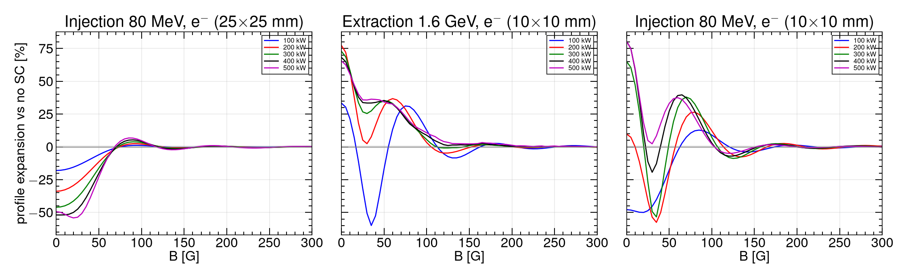

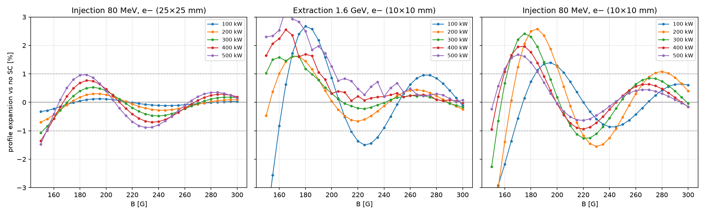

Smallest \(B\) after which \(|\Delta|\) stays below 1% for the rest of the grid, and \(\Delta\) at 300 G:

| Family | 100 kW | 200 kW | 300 kW | 400 kW | 500 kW |
|---|---|---|---|---|---|
| Inj. 25×25 mm | 105 G (+0.03%) | 115 G (+0.09%) | 155 G (+0.16%) | 155 G (+0.19%) | 155 G (+0.15%) |
| Ext. 10×10 mm | 240 G (−0.11%) | 190 G (−0.24%) | 185 G (−0.17%) | 195 G (−0.02%) | 205 G (+0.08%) |
| Inj. 10×10 mm | 210 G (+0.61%) | 290 G (+0.40%) | 235 G (−0.04%) | 190 G (−0.16%) | 190 G (−0.15%) |

Painted injection recovers first. Extraction and small injection still oscillate through ~150–250 G (tail plot). **300 G** puts every power \(\lesssim 1\%\); the 10×10 mm injection 200 kW curve is the last to settle (threshold 290 G).

### Block B — size scan 3–20 mm

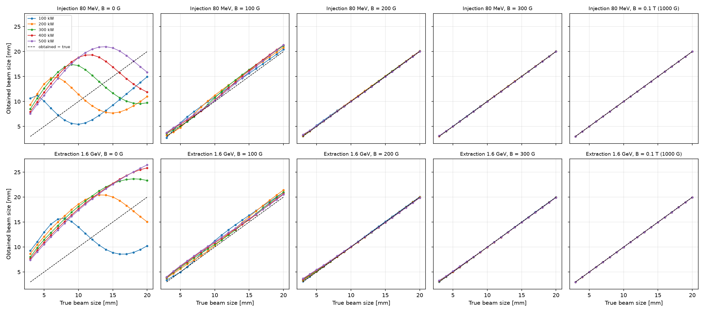

At \(B=0\) obtained \(\sigma\) is not a monotonic function of true \(\sigma\) (focusing vs over-kick). From **200 G** the points lie on the diagonal except the tiniest beams; at **300 G** injection 3 mm is still +1% (100 kW) to +4% (500 kW). **0.1 T** puts 3, 10, and 20 mm on the diagonal at every power.

### Block C — cage voltage 5–30 kV (inj. 10×10 mm)

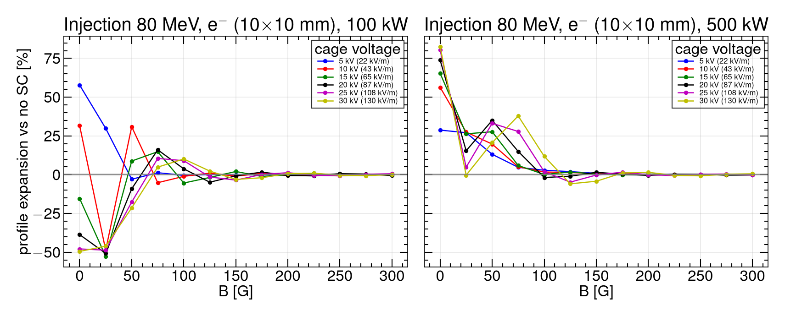

At \(B=0\), 100 kW goes from expansion (+58% at 5 kV) to compression (−48% at 25 kV). By **300 G** every voltage is \(\lesssim 1\%\) (30 kV / 500 kW: +0.6%).

### Block D — beam offset (10×10 mm)

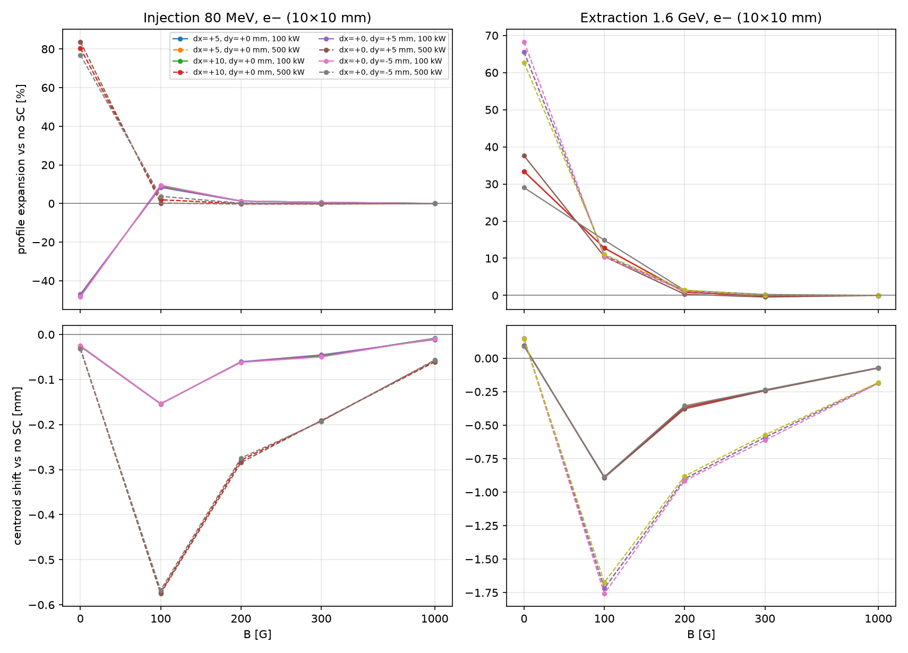

At **300 G** and **0.1 T**, expansion stays \(\lesssim 1\%\) for every offset. Centroid shift vs no-SC is \(\lesssim 0.2\,\mathrm{mm}\) (injection) and \(\lesssim 0.6\,\mathrm{mm}\) (extraction, 500 kW, 300 G). A few-mm orbit offset does not undo the \(B\) recovery.

CSV: `output/csns_emode_{bscan300,size,voltage,offset}_summary.csv`. Re-run: `./scripts/run_emode_replan.sh`.

---

## 9. Fine scan of Blocks C and D

Coarse C (5 kV × 25 G) and D (four offsets × 100 G) undersampled the 10–15 kV sign flip, the 0–150 G oscillations, and \(\Delta y\). Fine C/D fills those gaps. **Status: complete.** 3270 / 3270 new runs (5772 particle CSVs on disk including the A–D replan). Re-run: `./scripts/run_emode_fine_cd.sh`.

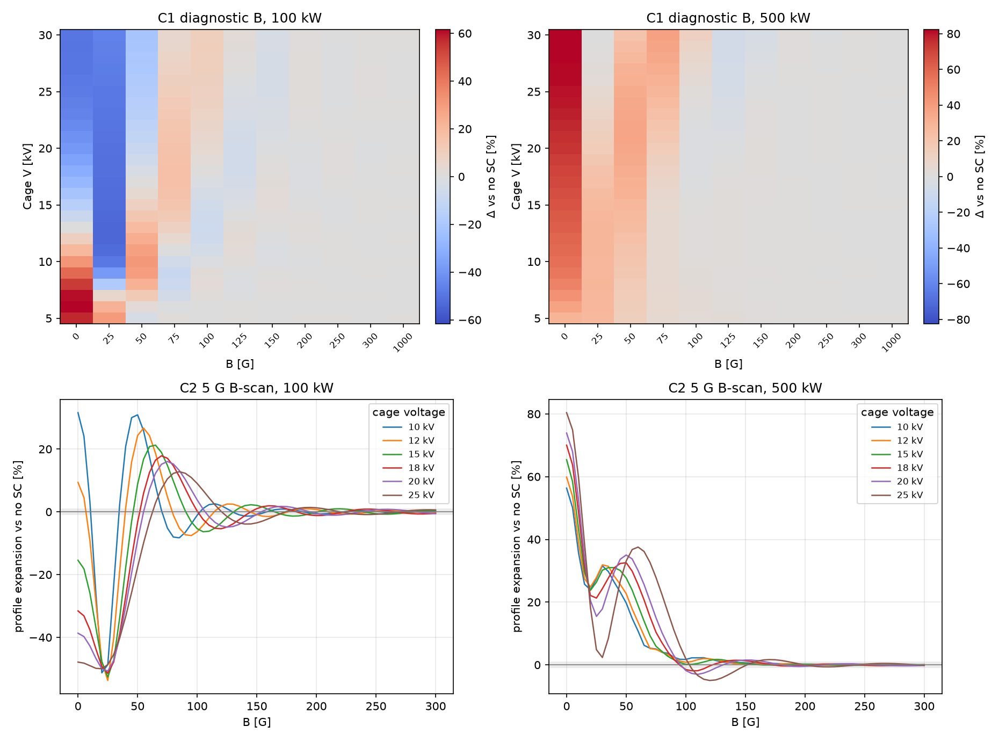

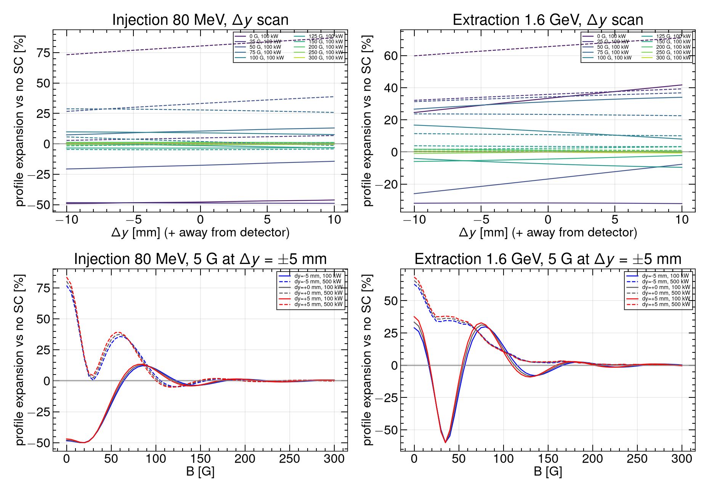

### Block C — 1 kV and 5 G

At \(B=0\), 100 kW the expansion **crosses zero at 13 kV** (12 kV +9.4%, 13 kV ~0%, 14 kV −8.3%). The coarse 5 kV step had only placed the flip somewhere between 10 and 15 kV. **500 kW never flips**: \(\Delta\) stays positive and grows with \(V\) (+29% at 5 kV to +83% at 30 kV).

The 5 G \(B\)-scans at 10, 12, 15, 18, 20 kV (25 kV from Block A) show the same cyclotron/ToF oscillation as Block A, with the first peak shifting later in \(B\) as \(V\) rises. Smallest \(B\) after which \(|\Delta|\) stays below 1% for the rest of 0–300 G:

| \(V\) [kV] | 100 kW | 500 kW | \(\Delta\) at 300 G (100 / 500 kW) |
|---:|---:|---:|---|
| 10 | 150 G | 130 G | +0.15% / +0.02% |
| 12 | 195 G | 135 G | −0.31% / −0.05% |
| 15 | 195 G | 145 G | +0.47% / +0.03% |
| 18 | 210 G | 160 G | −0.47% / +0.01% |
| 20 | 220 G | 170 G | −0.57% / −0.19% |
| 25 (Block A) | 210 G | 190 G | +0.61% / −0.15% |

**300 G** still puts every scanned voltage \(\lesssim 1\%\). Higher cage voltage needs more \(B\) at 100 kW (150 G at 10 kV → 220 G at 20 kV); 500 kW recovers earlier at every \(V\).

### Block D — 1 mm \(\Delta y\) and 5 G at \(\pm 5\,\mathrm{mm}\)

Expansion vs \(\Delta y\) is **smooth and nearly linear** from −10 to +10 mm at every diagnostic \(B\). Toward the detector (\(\Delta y<0\)) vs away (\(\Delta y>0\)) changes \(\Delta\) by a few percent at \(B=0\) (injection 500 kW: +73% at −10 mm to +87% at +10 mm) and by \(\lesssim 1\%\) once \(B=300\,\mathrm{G}\).

The 5 G \(B\)-scans at \(\Delta y=\pm 5\,\mathrm{mm}\) overlay the centred Block A curves. The 1% threshold moves by at most ~10 G:

| Family | \(\Delta y=-5\) | centred | \(\Delta y=+5\) |
|---|---|---|---|
| Inj. 100 kW | 210 G | 210 G | 205 G |
| Inj. 500 kW | 190 G | 190 G | 185 G |
| Ext. 100 kW | 245 G | 240 G | 235 G |
| Ext. 500 kW | 205 G | 205 G | 205 G |

A ±10 mm orbit offset in \(y\) does not undo the 300 G recovery.

CSV: `output/csns_emode_{voltage,offset}_fine_summary.csv`.

### Matrix that ran

Held fixed: 100000 electrons, Voitkiv H₂, round 10×10 mm, \(P=100\) and \(500\,\mathrm{kW}\), SC-off shared. Reused coarse C (252), coarse D (120), Block A 25 kV / 5 G, and Block A \(\Delta y=0\).

| Slice | Grid | New |
|---|---|---:|
| C1 | \(V=5\)–30 kV / 1 kV × 11 diagnostic \(B\) | 660 |
| C2 | 10, 12, 15, 18, 20 kV × 0–300 G / 5 G + 0.1 T | 738 |
| D1 | \(\Delta y=-10\ldots+10\,\mathrm{mm}\) / 1 mm, \(\Delta x=0\), diagnostic \(B\), inj.+ext. | 1260 |
| D2 | \(\Delta y=\pm 5\,\mathrm{mm}\) × 5 G \(B\)-scan; no \(\Delta x\) scan | 612 |
| **Total** | | **3270** |

Diagnostic \(B\): 0, 25, 50, 75, 100, 125, 150, 200, 250, 300, 1000 G. Not run: full 1 kV × 5 G cartesian, fine \(\Delta x\), extra powers.

### Not in this plan

- Extra powers (200/300/400 kW), bunch-length or mid-ramp energy
- Fine \(\Delta x\), combined \((\Delta x,\Delta y)\) orbits, voltages outside 5–30 kV
- Changing particle count, gas species, or cage geometry

Ion-mode A–D is section 10 / [`IMODE_REPORT.md`](IMODE_REPORT.md). Combined e-mode + ion-mode report: [`CSNS_IPM_REPORT.md`](CSNS_IPM_REPORT.md).

---

## 10. Ion-mode parameter-scan matrix (round beams)

Full write-up with all figures: **[IMODE_REPORT.md](IMODE_REPORT.md)** · PDF: **[IMODE_REPORT.pdf](IMODE_REPORT.pdf)**. Combined e-mode + ion-mode: **[CSNS_IPM_REPORT.md](CSNS_IPM_REPORT.md)** · **[CSNS_IPM_REPORT.pdf](CSNS_IPM_REPORT.pdf)**.

Parallel to the e-mode replan (section 8), but **without an ion \(B\)-scan** — only \(B_y\in\{0,200,1000\}\,\mathrm{G}\). Round beams (\(\sigma_y=\sigma_x\)); H₂⁺ / H₂O⁺ / N₂⁺; 100000 secondaries.

**Status: complete.** 2070 / 2070 runs.

### Block A — reference beams at 0 / 200 / 1000 G

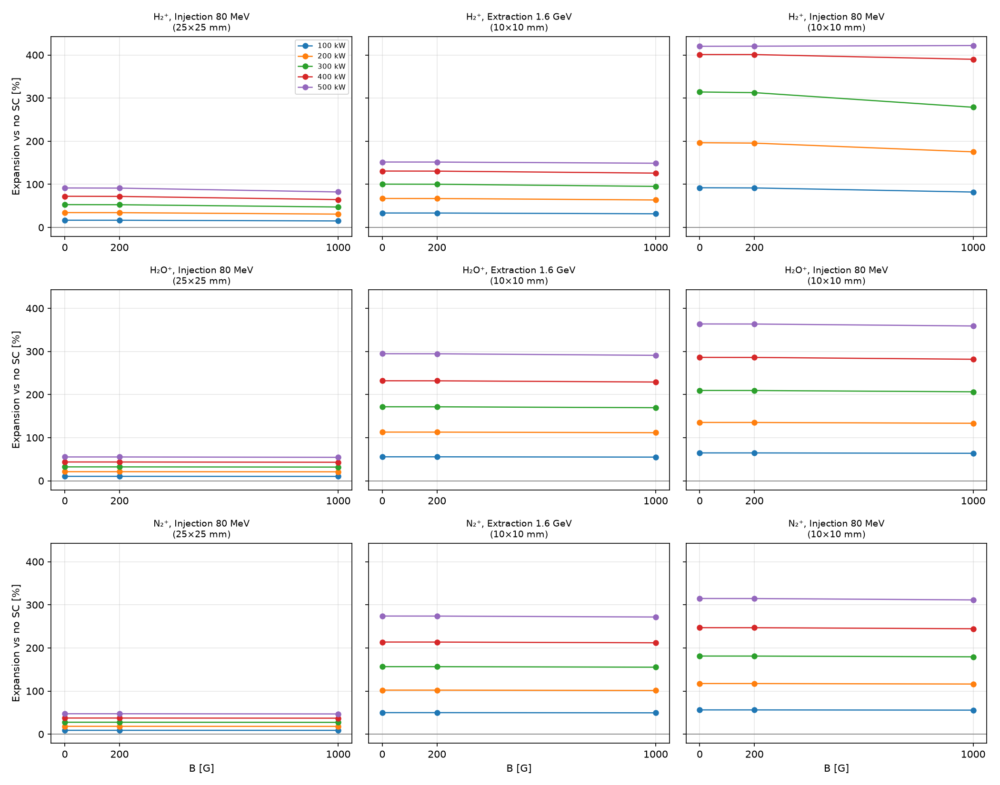

Expansion vs no-SC is **essentially independent of \(B\)** in this range (cyclotron radii are metres). Example — injection 10×10 mm, 100 kW:

| Species | 0 G | 200 G | 1000 G |
|---|---:|---:|---:|
| H₂⁺ | +92.0% | +91.6% | +82.1% |
| H₂O⁺ | +69.8% | +69.4% | +63.8% |
| N₂⁺ | +61.4% | +61.0% | +55.7% |

Guiding \(B\) does **not** restore ion profiles. The small drop at 0.1 T vs 0 G is not a recovery mechanism.

### Block B — size scan 3–20 mm

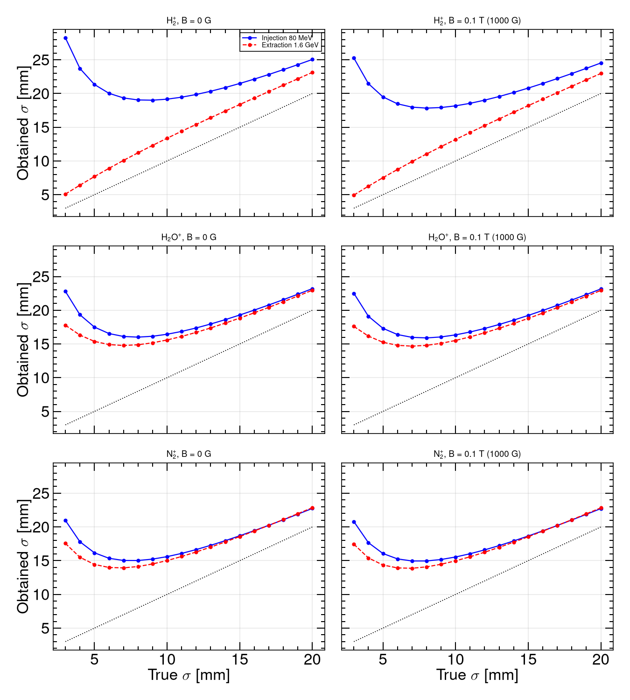

At **0.1 T / 100 kW**, obtained \(\sigma_x\) at true 10 mm (round beam): H₂⁺ 18.2 mm (+82%), H₂O⁺ 16.3 mm (+64%), N₂⁺ 15.5 mm (+56%) — close to the elliptical-beam §6 numbers. Points lie above the diagonal at every \(B\); smaller \(\sigma_x\) and higher power inflate more (same trend as §6).

### Block C — cage voltage 5–30 kV (inj. 10×10 mm)

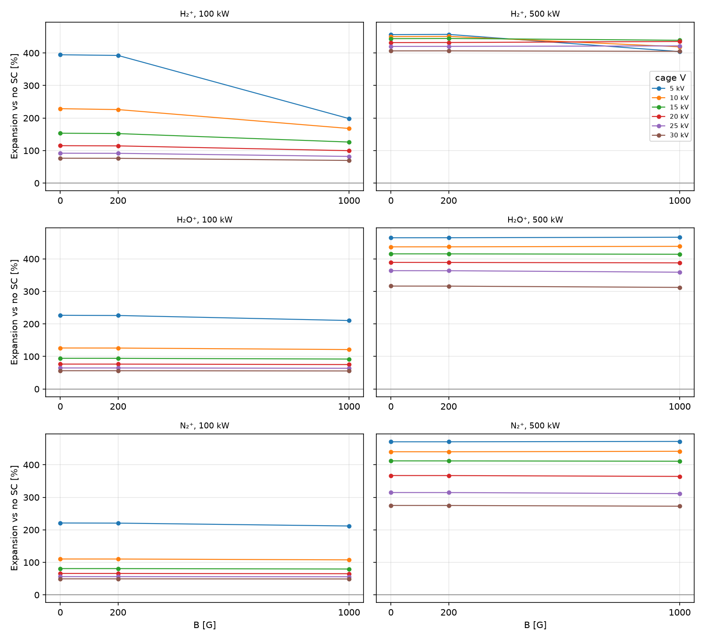

Unlike e-mode Block C, ion expansion **does not flip sign** with cage voltage: it stays positive at all \(V\) and \(B\). Higher \(V\) shortens ToF and can **reduce** the integrated kick (e.g. H₂⁺ @ 100 kW, 1000 G: +82% at 25 kV vs +68% at 5 kV).

### Block D — beam offset (10×10 mm)

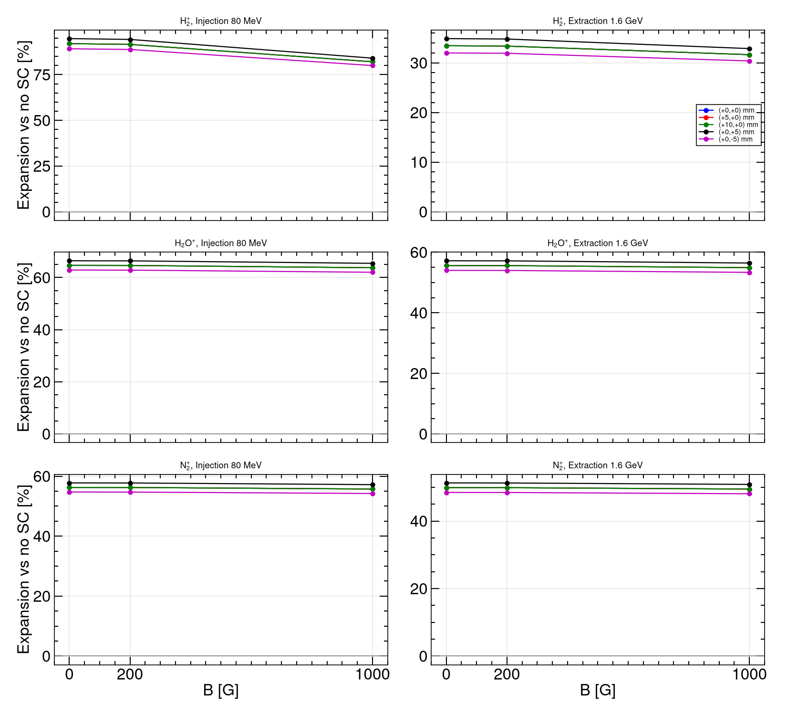

\(\Delta x=\pm5,+10\,\mathrm{mm}\) shifts the centroid but leaves expansion unchanged (translation invariance, as in e-mode). \(\Delta y=\pm5\,\mathrm{mm}\) changes expansion by a few % (detector-gap direction).

CSV: `output/csns_imode_{bscan,size,voltage,offset}_summary.csv`. Re-run: `./scripts/run_imode_replan.sh`.

---

## Appendix. All figures

**Fig. 1.** Residual-gas profiles at design \(B_y=0.1\,\mathrm{T}\) (100 kW, painted injection + extraction electrons; H₂⁺, H₂O⁺, N₂⁺).

**Fig. 2.** Coarse \(B\) scan: expansion and collection (0, 50, 100, 200, 250 G).

**Fig. 3.** Coarse \(B\) scan: \(\sigma_x\) vs \(B\) (e− and H₂⁺, injection and extraction).

**Fig. 4.** Coarse \(B\) scan: electron \(x\) profiles.

**Fig. 5.** Coarse \(B\) scan: H₂⁺ \(x\) profiles.

**Fig. 6.** Fine e-mode scan, 0–250 G step 5 G: expansion and \(\sigma_x\).

**Fig. 7.** Fine e-mode scan: \(x\) profiles at 0, 50, 100, 150, 200, 250 G (painted injection, extraction, 10 mm injection).

**Fig. 8.** Repeat at injection \(10\times 8\,\mathrm{mm}\), \(B_y=0.1\,\mathrm{T}\).

**Fig. 9.** E-mode \(B\) scan vs beam power (100–500 kW).

**Fig. 10.** Ion-mode expansion vs true \(\sigma_x\) for H₂⁺, H₂O⁺, N₂⁺ (injection and extraction, 100–500 kW).

**Fig. 11.** True beam size vs obtained beam size (same scan as Fig. 10). Dashed line: obtained = true.

**Fig. 12.** Replanned e-mode, Block A: expansion vs \(B\) 0–300 G (round beams, 100–500 kW).

**Fig. 13.** Same scan, 150–300 G zoom (\(\pm 3\%\)).

**Fig. 14.** Replanned e-mode, Block B: true vs obtained \(\sigma\) at 0, 100, 200, 300 G and 0.1 T.

**Fig. 15.** Replanned e-mode, Block C: cage voltage 5–30 kV on injection 10×10 mm.

**Fig. 16.** Replanned e-mode, Block D: beam offset on 10×10 mm injection and extraction.

**Fig. 17.** Fine C: 1 kV voltage heatmap at diagnostic \(B\), and 5 G \(B\)-scans at 10–25 kV.

**Fig. 18.** Fine D: expansion vs \(\Delta y\) at diagnostic \(B\), and 5 G \(B\)-scans at \(\Delta y=\pm 5\,\mathrm{mm}\).

**Fig. 19.** Ion-mode Block A: reference beams vs \(B\) (0, 200, 1000 G).

**Fig. 20.** Ion-mode Block B: true vs obtained \(\sigma\) (100 kW).

**Fig. 21.** Ion-mode Block B: expansion vs \(\sigma\) at 0.1 T and 100–500 kW.

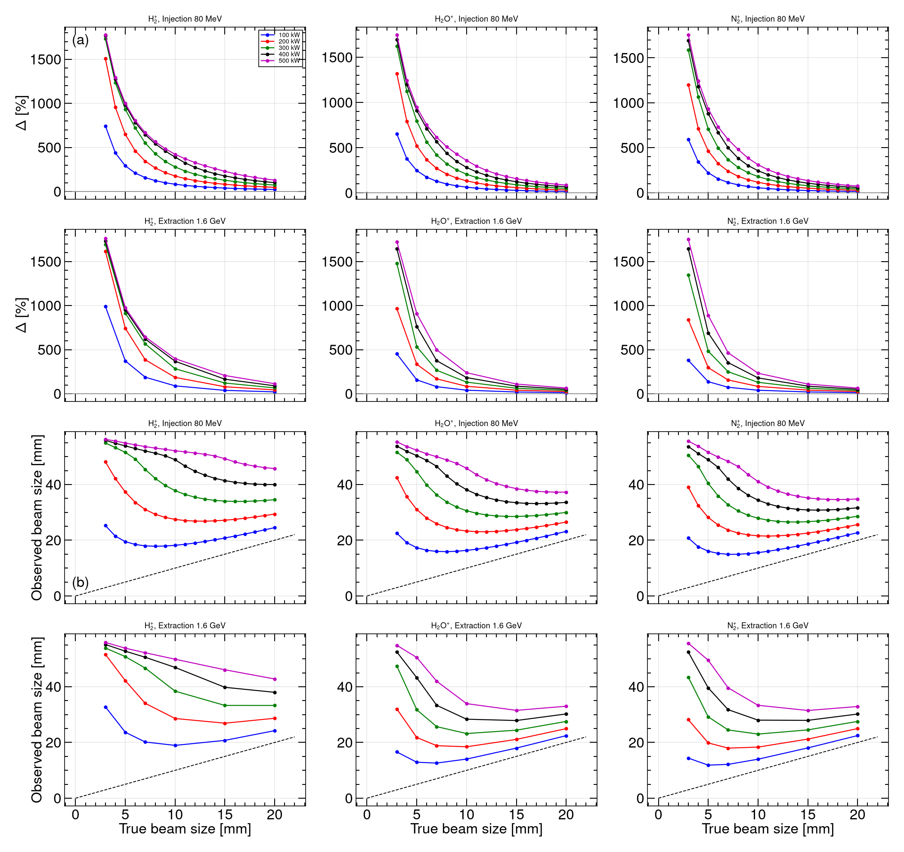

**Fig. 22.** Ion-mode Block C: cage voltage 5–30 kV.

**Fig. 23.** Ion-mode Block D: beam offset.

