# CSNS RCS IPM — Virtual-IPM results (brief)

**Code:** Virtual-IPM 2.3.1. **Beam / cage:** NIMA **1092** (2026) 171809, 100 kW CSNS RCS; ideal uniform \(E_y = 25\,\mathrm{kV}/231\,\mathrm{mm} \approx 108\,\mathrm{kV/m}\). **Space charge:** Gaussian bunch \(E\) plus Lorentz-boosted bunch \(B\), compared with those fields off. Guiding \(E\) and \(B\) stay uniform. **Statistics:** 100000 secondaries per run; quoted \(\sigma\) is the RMS of **detected** \(x\).

Injection: 80 MeV, \(\sigma_t=120\,\mathrm{ns}\), \(\sigma_{x,y}=25\times 20\,\mathrm{mm}\), \(7.8\times10^{12}\) p/bunch. Extraction: 1.6 GeV, \(\sigma_t=20\,\mathrm{ns}\), \(\sigma_{x,y}=10\times 8\,\mathrm{mm}\). Residual-gas ions follow the paper ToF peaks (H₂, H₂O, N₂). Electron ionization uses Voitkiv DDCS on **hydrogen** (Virtual-IPM has no N₂/H₂O electron DDCS).

---

## 1. Design field \(B_y = 0.1\,\mathrm{T}\) (1000 G)

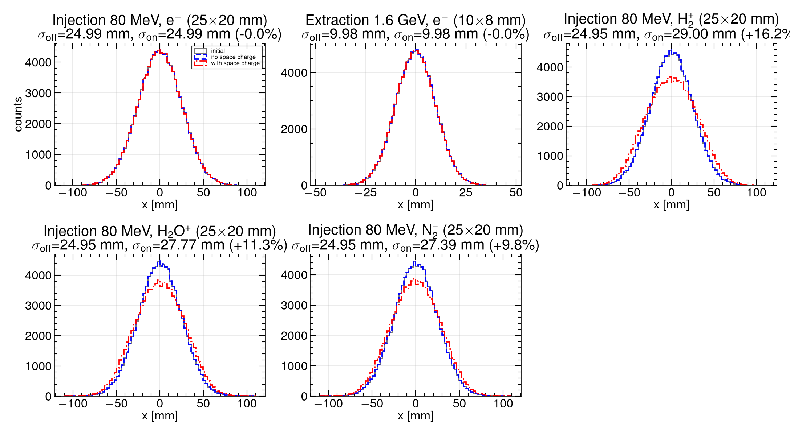

| Case | \(\sigma\) no SC [mm] | \(\sigma\) with SC [mm] | Expansion |
|---|---:|---:|---:|
| Injection e− | 24.99 | 24.99 | ~0% |
| Extraction e− | 9.98 | 9.98 | ~0% |
| Injection H₂⁺ (2 u) | 24.96 | 29.00 | **+16.2%** |
| Injection H₂O⁺ (18 u) | 24.96 | 27.77 | **+11.3%** |
| Injection N₂⁺ (28 u) | 24.96 | 27.39 | **+9.8%** |

At the PAC’09 design field, **electron mode is faithful**: space charge does not change the detected profile (rms particle \(\Delta x \sim 0.08\text{–}0.11\,\mathrm{mm}\)).

**Ion mode is not.** Ions sit in the cage for microseconds and integrate the bunch field. Expansion falls with mass (\(\Delta v = q\int E_\mathrm{sc}\,dt/m\)): H₂⁺ is worst, then H₂O⁺, then N₂⁺. Without space charge the ion \(\sigma\) matches the true beam; with space charge the IPM overestimates the width.

---

## 2. Guiding-\(B\) scan (0, 50, 100, 200 G)

\(1\,\mathrm{G}=10^{-4}\,\mathrm{T}\). Electron and H₂⁺ ion modes, injection and extraction. Collection remains \(\approx 100\%\).

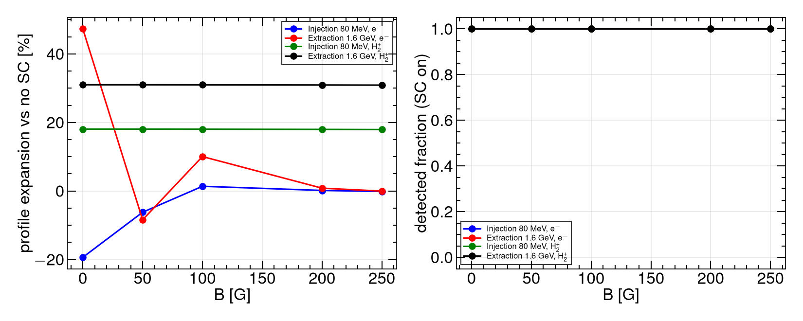

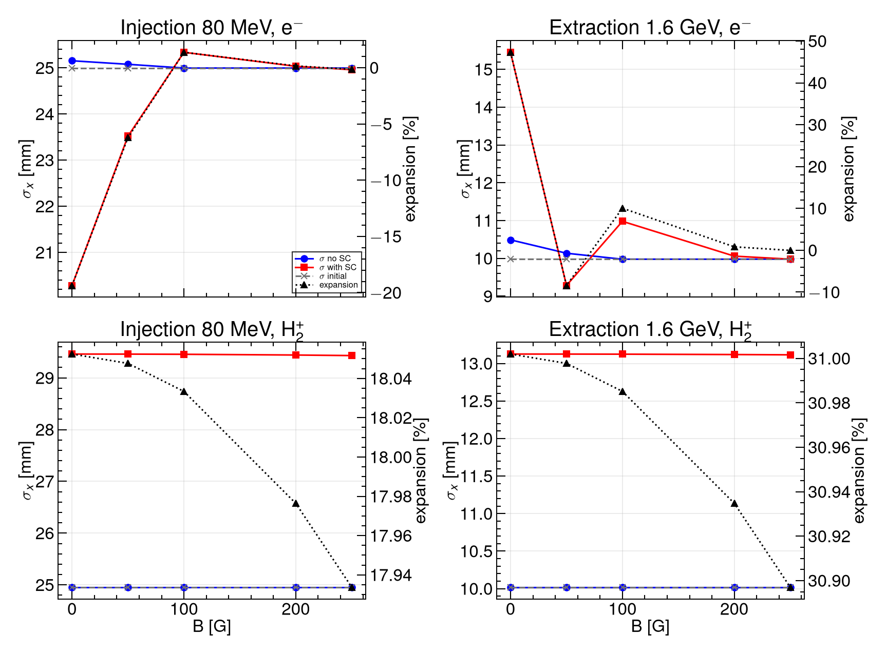

| \(B\) | Inj. e− | Ext. e− | Inj. H₂⁺ | Ext. H₂⁺ |
|---:|---:|---:|---:|---:|
| 0 G | −19.4% | **+47.3%** | +18.1% | **+31.0%** |
| 50 G | −6.2% | −8.4% | +18.1% | +31.0% |
| 100 G | +1.4% | +10.0% | +18.0% | +31.0% |
| 200 G | +0.15% | +0.82% | +18.0% | +30.9% |

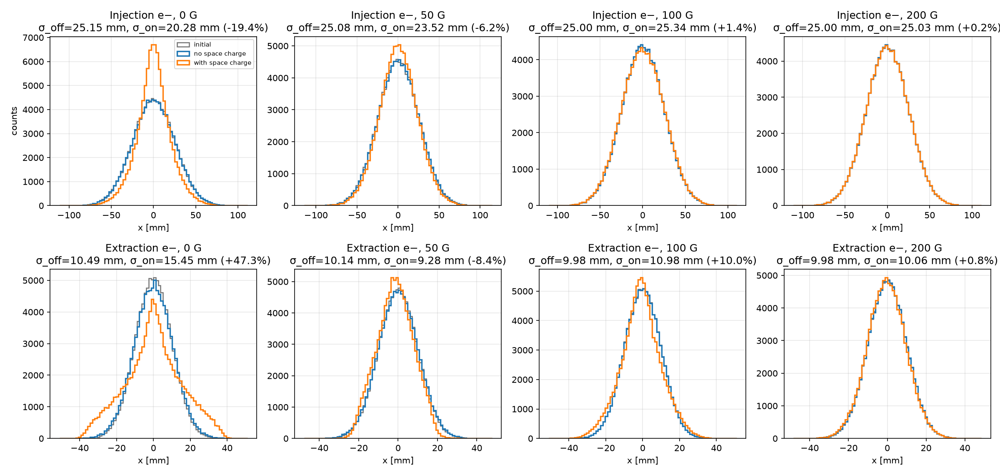

**Electrons.** With \(B=0\), the proton bunch acts on opposite-sign secondaries: injection **compresses** (−19%); extraction **over-kicks** and the detected profile widens (+47%). The extraction scan is non-monotonic (compression at 50 G, residual +10% at 100 G). **200 G restores both electron profiles to \(\lesssim 1\%\)**. The 0.1 T design is well above that threshold.

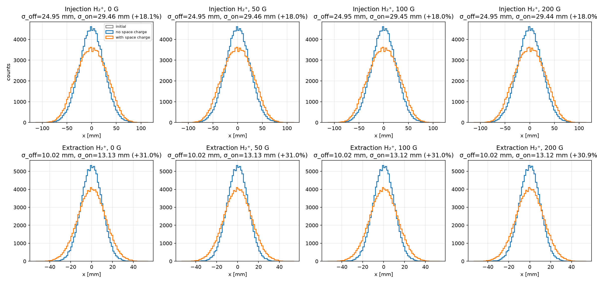

**Ions.** Cyclotron radii at \(\le 200\,\mathrm{G}\) are metres, so this \(B\) scan does not suppress ion space charge. Extraction H₂⁺ expands **~31%** vs **~18%** at injection: the 1.6 GeV bunch is shorter, smaller, and more relativistic. (At 0.1 T, injection H₂⁺ is slightly lower, +16.2%.)

---

## 3. Fine e-mode scan (0–250 G, step 5 G)

Electron mode only; 51 field values; 100000 particles; SC on vs off.

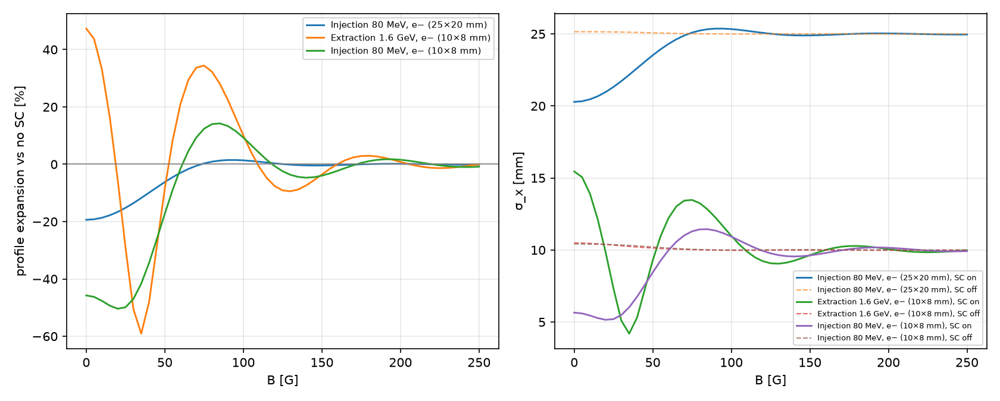

| \(B\) [G] | Inj. e− (25×20 mm) | Ext. e− (10×8 mm) | Inj. e− (10×8 mm) |
|---:|---:|---:|---:|
| 0 | −19.4% | +47.3% | −45.7% |
| 25 | −15.2% | −29.1% | −49.9% |
| 50 | −6.2% | −8.4% | −17.2% |
| 75 | +0.3% | +34.4% | +12.4% |
| 100 | +1.4% | +10.0% | +9.3% |
| 150 | −0.4% | −3.6% | −4.0% |
| 200 | +0.15% | +0.82% | +1.57% |
| 250 | −0.15% | −0.03% | −0.85% |

The expansion **oscillates** with \(B\) (focusing / over-focusing of opposite-sign electrons). Thresholds after which \(|\Delta|\) stays below 1%: painted injection **110 G**, extraction **240 G**, 10 mm injection **250 G**. **0.1 T removes the residual** in all three cases.

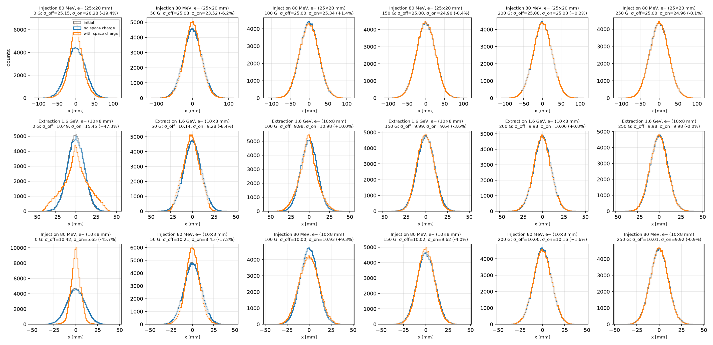

---

## 4. Injection RMS 10 mm (repeat)

Injection \(\sigma_x=10\,\mathrm{mm}\), \(\sigma_y=8\,\mathrm{mm}\) (same 5:4 aspect as 25×20). Energy, bunch length, and charge unchanged (80 MeV, 120 ns, \(7.8\times10^{12}\)).

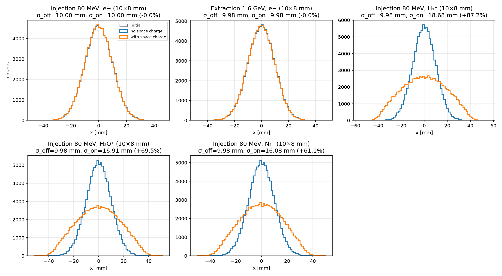

Design field \(B_y=0.1\,\mathrm{T}\):

| Case | \(\sigma\) no SC [mm] | \(\sigma\) with SC [mm] | Expansion | vs 25×20 mm |
|---|---:|---:|---:|---:|
| Injection e− (10×8) | 10.00 | 10.00 | ~0% | still ~0% |
| Extraction e− (unchanged) | 9.98 | 9.98 | ~0% | — |
| Injection H₂⁺ | 9.98 | 18.68 | **+87.2%** | was +16.2% |
| Injection H₂O⁺ | 9.98 | 16.91 | **+69.5%** | was +11.3% |
| Injection N₂⁺ | 9.98 | 16.08 | **+61.1%** | was +9.8% |

H₂⁺ at 0–250 G is **+97%** (independent of \(B\)); 0.1 T only trims that to +87%. Peak bunch \(E_x\) scales up when the same charge is packed into a 2.5× smaller transverse size, so **relative** ion expansion grows by \(\sim 5\times\).

---

## 5. E-mode \(B\) scan vs beam power (100–500 kW)

Same 0–250 G / 5 G e-mode scan at painted injection and extraction. Bunch population \(N_b \propto P\) (100 kW = \(7.8\times10^{12}\)/bunch). SC-off trajectories are independent of \(P\) and are reused.

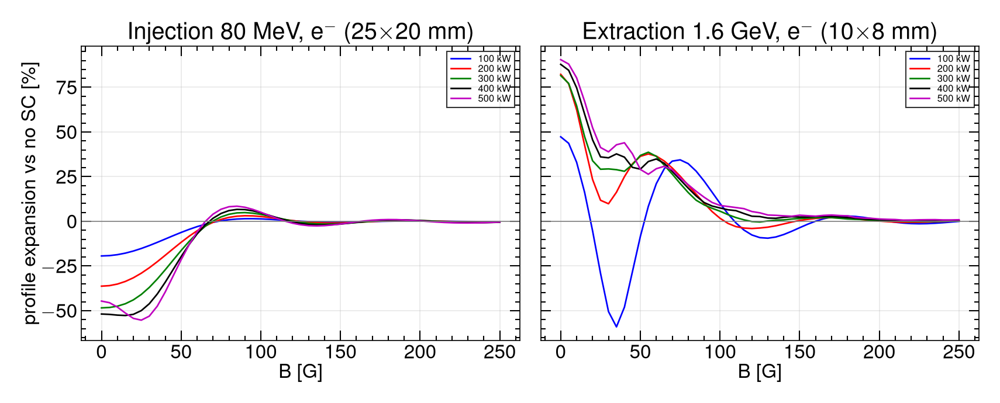

| \(B=250\,\mathrm{G}\) | 100 kW | 200 kW | 300 kW | 400 kW | 500 kW |
|---|---:|---:|---:|---:|---:|
| Injection e− (25×20 mm) | −0.15% | −0.32% | −0.46% | −0.48% | −0.39% |
| Extraction e− (10×8 mm) | −0.03% | +0.19% | +0.10% | +0.41% | +0.88% |

Low \(B\) gets worse with power (injection at 0 G: −19% → −52%). By **250 G** every power is still \(\lesssim 1\%\). \(|\Delta|<1\%\) thereafter needs ~110–160 G at injection and ~190–240 G at extraction (higher \(P\) needs a bit more \(B\)).

---

## 6. Ion-mode size scan (3–20 mm) vs power — H₂⁺, H₂O⁺, N₂⁺

All three ToF species, \(B_y=0.1\,\mathrm{T}\), \(\sigma_x = 3\ldots20\,\mathrm{mm}\) (1 mm), \(\sigma_y=0.8\,\sigma_x\), injection and extraction, 100–500 kW. H₂⁺ space-charge-off profiles are reused (no bunch field ⇒ obtained \(x\) = birth \(x\)).

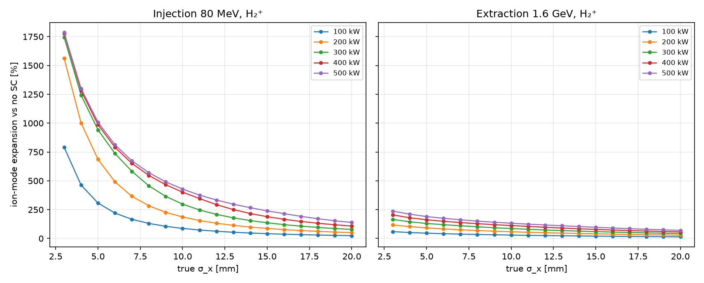

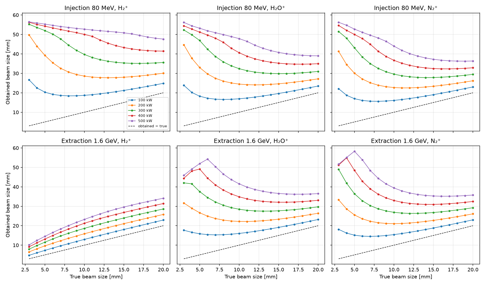

Obtained \(\sigma_x\) at true \(\sigma_x = 10\,\mathrm{mm}\):

| Species | Inj. 100 kW | Inj. 500 kW | Ext. 100 kW | Ext. 500 kW |
|---|---:|---:|---:|---:|
| H₂⁺ | 18.7 mm (+87%) | 52.7 mm (+428%) | 13.0 mm (+29%) | 23.2 mm (+132%) |
| H₂O⁺ | 16.9 mm (+69%) | 47.9 mm (+380%) | 16.0 mm (+60%) | 41.5 mm (+314%) |
| N₂⁺ | 16.1 mm (+61%) | 44.0 mm (+341%) | 15.4 mm (+54%) | 39.4 mm (+293%) |

The dashed line on the obtained plot is **obtained = true**. Points above it are space-charge inflated. At injection, H₂⁺ is worst (largest \(\Delta v/m\)). At extraction the short bunch plus 0.1 T keeps H₂⁺ nearer the diagonal; H₂O⁺ and N₂⁺ stay in the cage longer and inflate more. Very small \(\sigma_x\) at high power saturates (cage walls).

---

## 7. Takeaways

1. **Electron IPM:** 250 G finishes the recovery that 200 G almost completed (10 mm injection −0.85%). At 100–500 kW, **250 G keeps e-mode within 1%**. 0.1 T remains conservative.
2. **Ion IPM** is not helped by 0–250 G. Distortion scales up with power and down with \(\sigma_x\).
3. A **small injection beam at high power** is the worst ion-mode case (obtained \(\sigma\) tens of mm for a 3–10 mm beam). Extraction H₂⁺ is milder; extraction H₂O⁺/N₂⁺ are much worse than H₂⁺ at small \(\sigma_x\).
4. Among residual gases at **injection**, **hydrogen is the worst actor**. At **extraction**, H₂O⁺ and N₂⁺ inflate more than H₂⁺ (longer ToF).
5. Cage fields are ideal and uniform; MCP mapping is not in these runs.

CSV: `output/csns_space_charge_summary.csv`, `output/csns_bscan_summary.csv`, `output/csns_bscan5_summary.csv`, `output/csns_space_charge_summary_sig10.csv`, `output/csns_bscan_power_summary.csv`, `output/csns_ionsize_summary.csv`, `output/csns_emode_summary.csv`, `output/csns_emode_sig10_summary.csv`. Closed 5 G / ion grids: `./scripts/run_extended_scans.sh`. E-mode replan: `./scripts/run_emode_replan.sh`.

---

## 8. E-mode parameter-scan replan

The 0–250 G / 5 G campaign (sections 3 and 5) is the **high-resolution \(B\) reference** and is **closed**. It oversampled \(B\) once painted injection had recovered (~110 G) and never scanned beam size in e-mode. The 10 mm injection family — the most \(B\)-hungry case at 100 kW — was also missing from the 200–500 kW grid.

New matrix (Voitkiv H₂, 100000 particles, SC on vs off; off reused across power):

| Scan | \(\sigma_x\) | \(B\) | Power | Stage |
|---|---|---|---|---|
| Size × diagnostic \(B\) × \(P\) | 3–20 mm, 1 mm (\(\sigma_y=0.8\sigma_x\)) | 0, 250 G, 0.1 T | 100–500 kW | injection + extraction |
| 10 mm injection \(B\times P\) fill-in | 10×8 mm | 50, 100, 150, 200 G | 200–500 kW | injection |

Diagnostic fields: **0** (largest space-charge kick), **250 G** (previous \(\lesssim 1\%\) edge), **0.1 T** (PAC’09 design). Matching CSVs from the closed scans are reused.

Results follow after the new runs (summaries `output/csns_emode_summary.csv`, `output/csns_emode_sig10_summary.csv`; figures 12–14).

---

## Appendix. All figures

**Fig. 1.** Residual-gas profiles at design \(B_y=0.1\,\mathrm{T}\) (100 kW, painted injection + extraction electrons; H₂⁺, H₂O⁺, N₂⁺).

**Fig. 2.** Coarse \(B\) scan: expansion and collection (0, 50, 100, 200, 250 G).

**Fig. 3.** Coarse \(B\) scan: \(\sigma_x\) vs \(B\) (e− and H₂⁺, injection and extraction).

**Fig. 4.** Coarse \(B\) scan: electron \(x\) profiles.

**Fig. 5.** Coarse \(B\) scan: H₂⁺ \(x\) profiles.

**Fig. 6.** Fine e-mode scan, 0–250 G step 5 G: expansion and \(\sigma_x\).

**Fig. 7.** Fine e-mode scan: \(x\) profiles at 0, 50, 100, 150, 200, 250 G (painted injection, extraction, 10 mm injection).

**Fig. 8.** Repeat at injection \(10\times 8\,\mathrm{mm}\), \(B_y=0.1\,\mathrm{T}\).

**Fig. 9.** E-mode \(B\) scan vs beam power (100–500 kW).

**Fig. 10.** Ion-mode expansion vs true \(\sigma_x\) for H₂⁺, H₂O⁺, N₂⁺ (injection and extraction, 100–500 kW).

**Fig. 11.** True beam size vs obtained beam size (same scan as Fig. 10). Dashed line: obtained = true.

